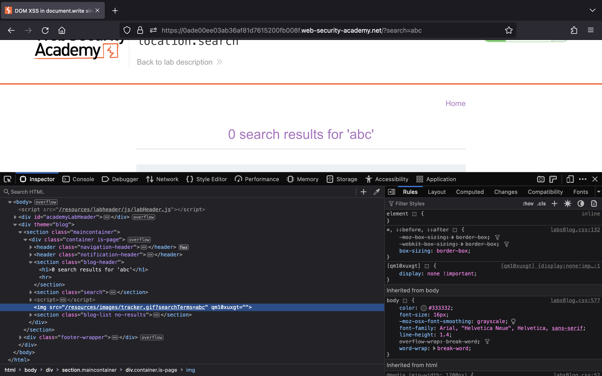
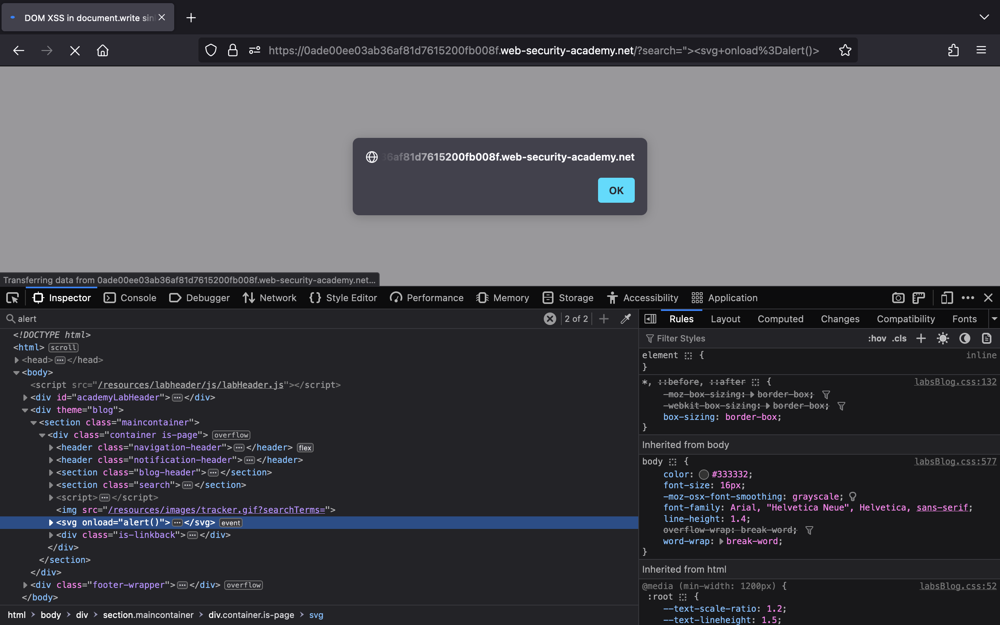
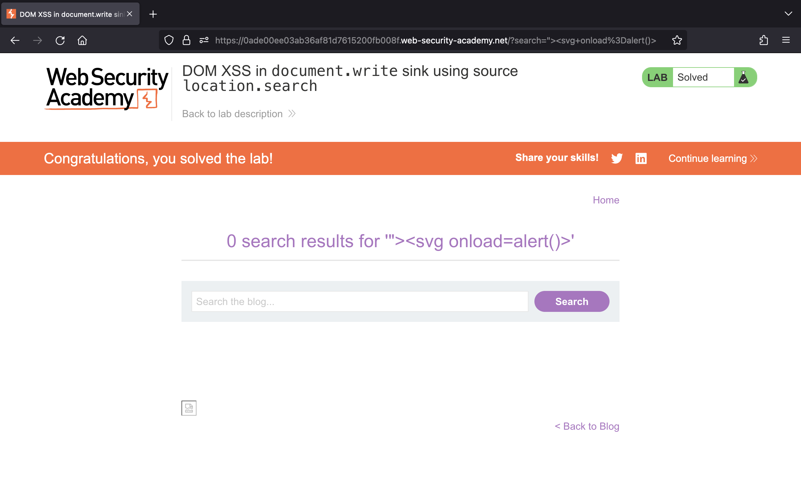
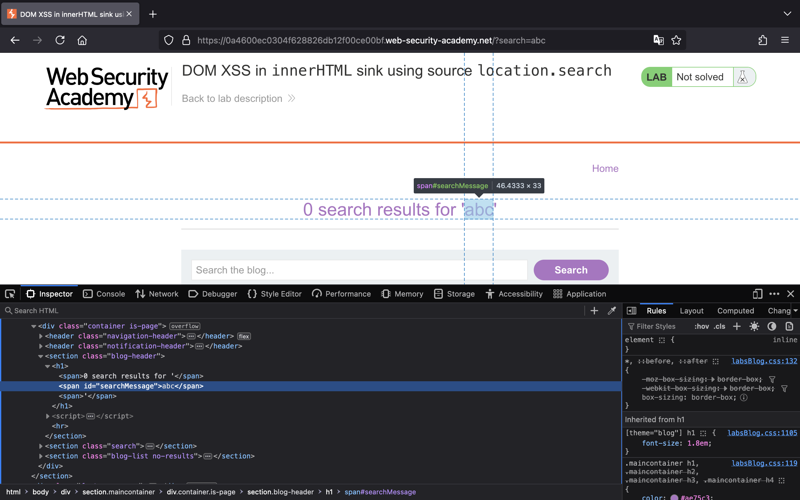
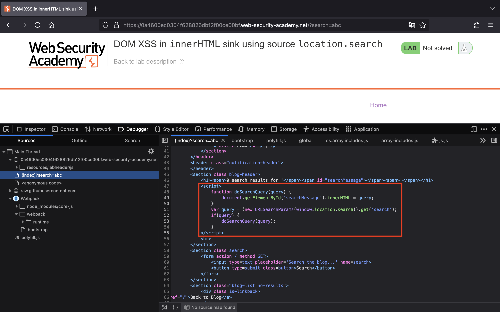
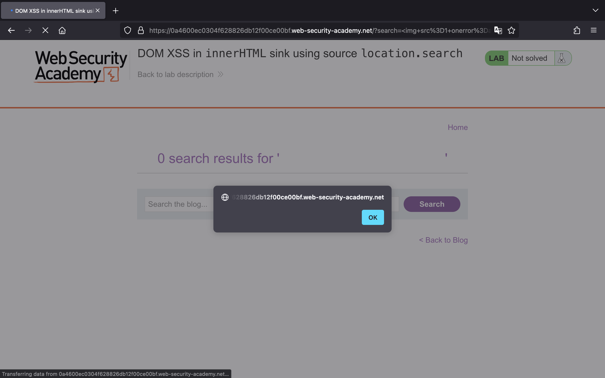
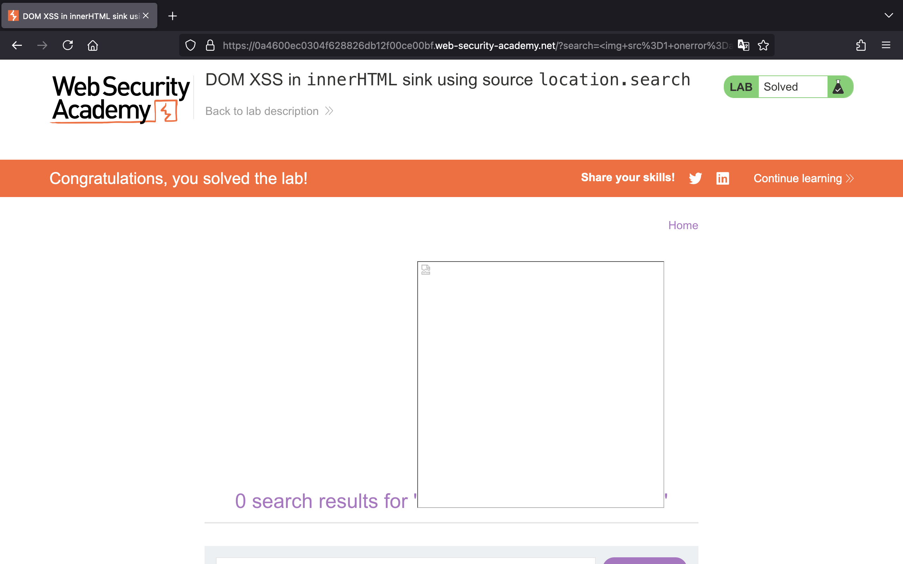

# Cross-site scripting (XSS)

## Lab 1: [Reflected XSS into HTML context with nothing encoded](https://portswigger.net/web-security/cross-site-scripting/reflected/lab-html-context-nothing-encoded)

> This lab contains a simple reflected cross-site scripting vulnerability in the search functionality.
>
> To solve the lab, perform a cross-site scripting attack that calls the `alert` function.

Truy cập vào lab, chúng ta thấy một trang web như sau:


Theo như mô tả của bài thì trang web dính lỗ hổng XSS ở chức năng tìm kiếm, để giải được thử thách chúng ta cần khai thác XSS để gọi đến hàm `alert()`.

Vậy, chúng ta thử nhập vào ô tìm kiếm thẻ `<script>` bên dưới và nhấn search.

```js
<script>alert()</script>
```


Chúng ta đã thực hiện XSS thành công và giải được bài lab:


## Lab 2: [Stored XSS into HTML context with nothing encoded](https://portswigger.net/web-security/cross-site-scripting/stored/lab-html-context-nothing-encoded)

> This lab contains a stored cross-site scripting vulnerability in the comment functionality.
>
> To solve this lab, submit a comment that calls the alert function when the blog post is viewed.

Bên dưới là giao diện của trang web:


Theo như mô tả của bài lab, trang web này dính lỗi XSS ở chức năng comment, để giải được thì chúng ta cần gọi đến hàm `alert()`.

Trước tiên, chúng ta vào một bài viết và nhập vào các trường như sau:


Nhấn "Post Comment", chúng ta sẽ giải được bài lab:


## Lab 3: [DOM XSS in `document.write` sink using source `location.search`](https://portswigger.net/web-security/cross-site-scripting/dom-based/lab-document-write-sink)

> This lab contains a DOM-based cross-site scripting vulnerability in the search query tracking functionality. It uses the JavaScript document.write function, which writes data out to the page. The document.write function is called with data from location.search, which you can control using the website URL.
>
> To solve this lab, perform a cross-site scripting attack that calls the alert function.

Truy cập vào lab, chúng ta thấy một trang web như sau:


Nếu thử tìm kiếm `abc` rồi Inspect kiểm tra, chúng ta sẽ thấy giá trị mình nhập vào đang được truyền tới thuộc tính `src` của hình ảnh:



Dó đó, để khai thác XSS thành công, chúng ta cần phải thoát ra khỏi cặp dấu `"`. Chúng ta có thể sử dụng payload `"><svg onload=alert()>`:



Và giải thành công bài lab:



## Lab 4: [DOM XSS in `innerHTML` sink using source `location.search`](https://portswigger.net/web-security/cross-site-scripting/dom-based/lab-innerhtml-sink)

> This lab contains a DOM-based cross-site scripting vulnerability in the search blog functionality. It uses an innerHTML assignment, which changes the HTML contents of a div element, using data from location.search.
>
> To solve this lab, perform a cross-site scripting attack that calls the alert function.

Truy cập vào bài lab, chúng ta thấy một trang web như sau:


Thử tìm kiếm `abc` rồi Inspect, chúng ta sẽ biết giá trị đó đang được đưa vào thẻ `<span>`:



Nếu để ý source code, chúng ta sẽ thấy có đoạn JavaScript được sử dụng để lấy chuỗi tìm kiếm từ tham số `search` và gán nó cho thuộc tính `innerHTML`:



Bởi vì sink `innerHTML` không cho phép thực thi JavaScript ở thẻ `<script>` hay event `onload` của thẻ `<svg>` nên chúng ta cần sử dụng một payload khác.

Chúng ta sẽ dùng payload ``:



Thực hiện XSS thành công và chúng ta đã giải được bài lab:


