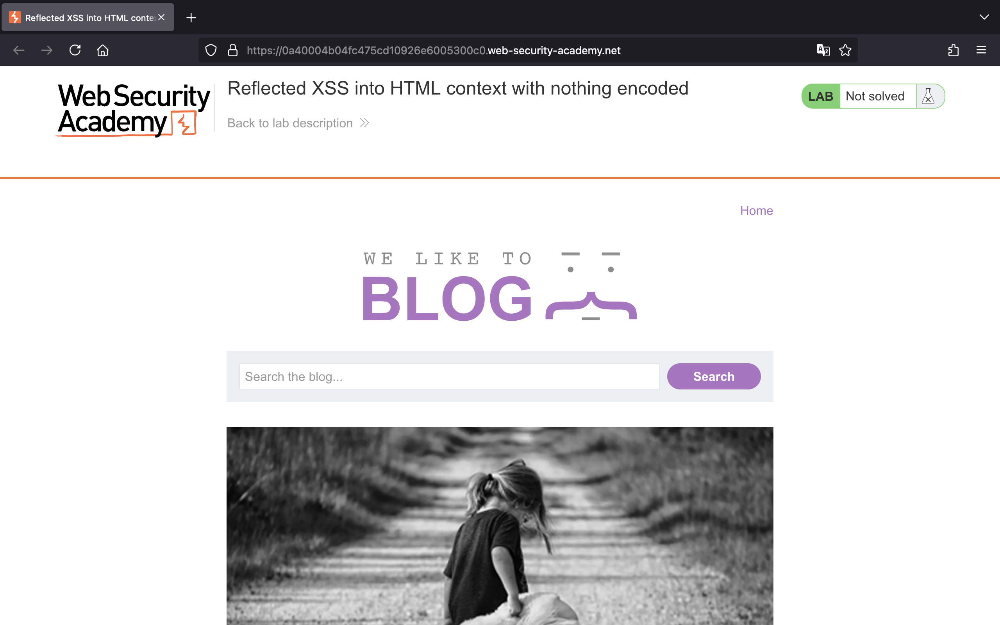
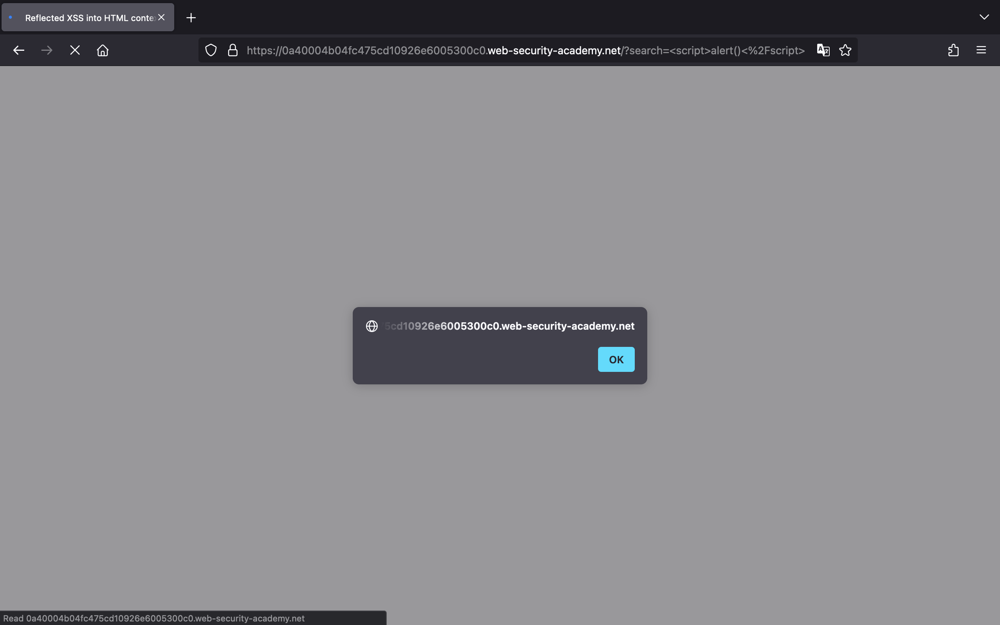
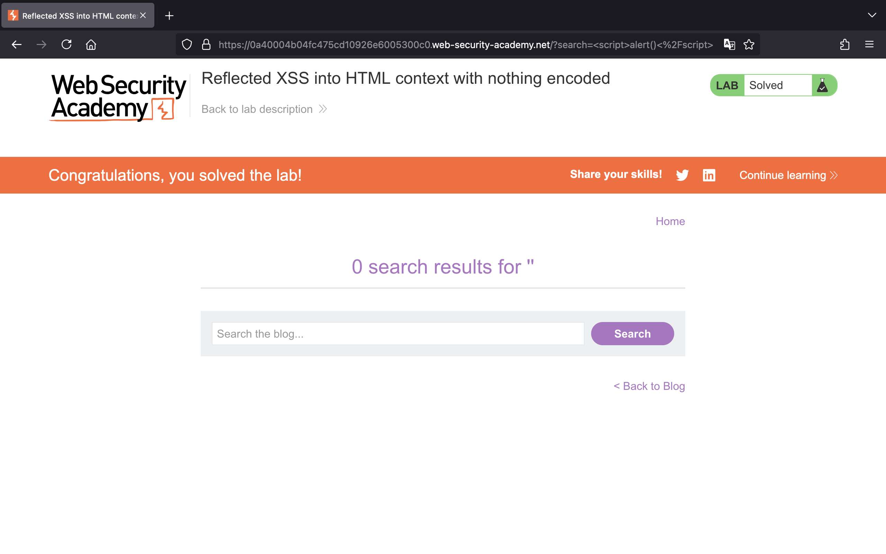
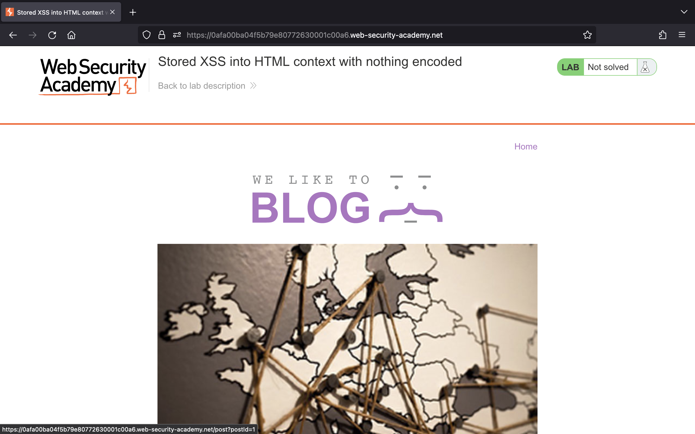
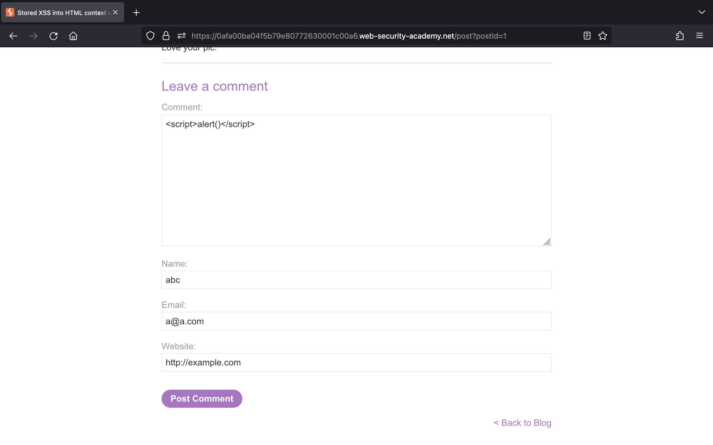
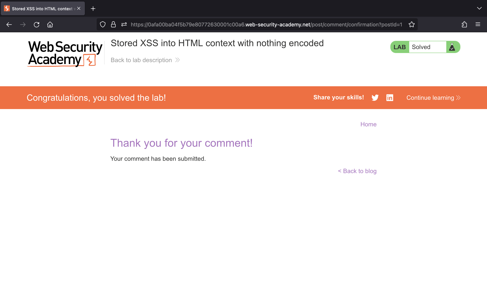

# Cross-site scripting (XSS)

## Lab 1: [Reflected XSS into HTML context with nothing encoded](https://portswigger.net/web-security/cross-site-scripting/reflected/lab-html-context-nothing-encoded)

> This lab contains a simple reflected cross-site scripting vulnerability in the search functionality.
>
> To solve the lab, perform a cross-site scripting attack that calls the `alert` function.

Truy cập vào lab, chúng ta thấy một trang web như sau:



Theo như mô tả của bài thì trang web dính lỗ hổng XSS ở chức năng tìm kiếm, để giải được thử thách chúng ta cần khai thác XSS để gọi đến hàm `alert()`.

Vậy, chúng ta thử nhập vào ô tìm kiếm thẻ `<script>` bên dưới và nhấn search.

```js
<script>alert()</script>
```



Chúng ta đã thực hiện XSS thành công và giải được bài lab:



## Lab 2: [Stored XSS into HTML context with nothing encoded](https://portswigger.net/web-security/cross-site-scripting/stored/lab-html-context-nothing-encoded)

> This lab contains a stored cross-site scripting vulnerability in the comment functionality.
>
> To solve this lab, submit a comment that calls the alert function when the blog post is viewed.

Bên dưới là giao diện của trang web:



Theo như mô tả của bài lab, trang web này dính lỗi XSS ở chức năng comment, để giải được thì chúng ta cần gọi đến hàm `alert()`.

Trước tiên, chúng ta vào một bài viết và nhập vào các trường như sau:



Nhấn "Post Comment", chúng ta sẽ giải được bài lab:


