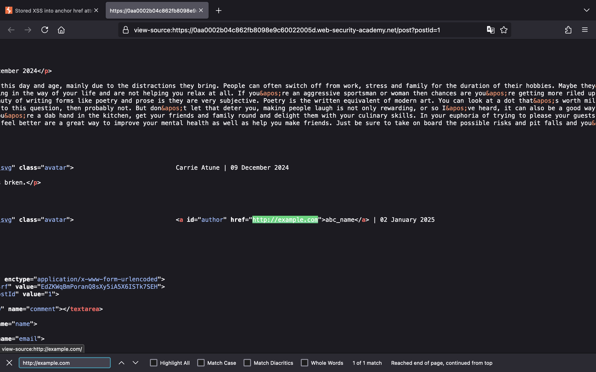
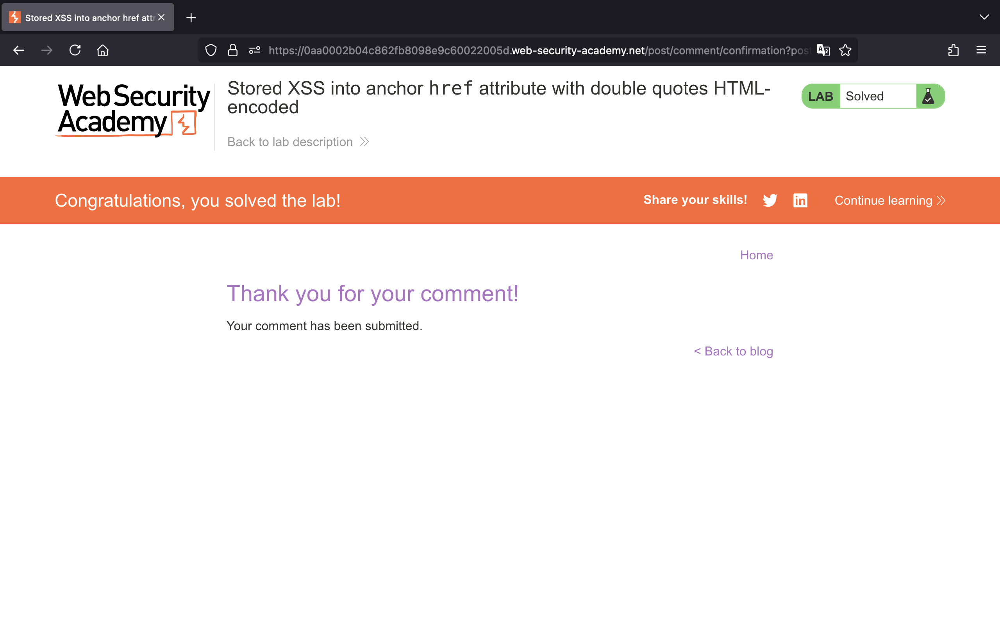

# Cross-site scripting (XSS)

## Lab 1: [Reflected XSS into HTML context with nothing encoded](https://portswigger.net/web-security/cross-site-scripting/reflected/lab-html-context-nothing-encoded)

> This lab contains a simple reflected cross-site scripting vulnerability in the search functionality.
>
> To solve the lab, perform a cross-site scripting attack that calls the `alert` function.

Truy cập vào lab, chúng ta thấy một trang web như sau:


Theo như mô tả của bài thì trang web dính lỗ hổng XSS ở chức năng tìm kiếm, để giải được thử thách chúng ta cần khai thác XSS để gọi đến hàm `alert()`.

Vậy, chúng ta thử nhập vào ô tìm kiếm thẻ `<script>` bên dưới và nhấn search.

```js
<script>alert()</script>
```


Chúng ta đã thực hiện XSS thành công và giải được bài lab:


## Lab 2: [Stored XSS into HTML context with nothing encoded](https://portswigger.net/web-security/cross-site-scripting/stored/lab-html-context-nothing-encoded)

> This lab contains a stored cross-site scripting vulnerability in the comment functionality.
>
> To solve this lab, submit a comment that calls the alert function when the blog post is viewed.

Bên dưới là giao diện của trang web:


Theo như mô tả của bài lab, trang web này dính lỗi XSS ở chức năng comment, để giải được thì chúng ta cần gọi đến hàm `alert()`.

Trước tiên, chúng ta vào một bài viết và nhập vào các trường như sau:


Nhấn "Post Comment", chúng ta sẽ giải được bài lab:


## Lab 3: [DOM XSS in `document.write` sink using source `location.search`](https://portswigger.net/web-security/cross-site-scripting/dom-based/lab-document-write-sink)

> This lab contains a DOM-based cross-site scripting vulnerability in the search query tracking functionality. It uses the JavaScript document.write function, which writes data out to the page. The document.write function is called with data from location.search, which you can control using the website URL.
>
> To solve this lab, perform a cross-site scripting attack that calls the alert function.

Truy cập vào lab, chúng ta thấy một trang web như sau:


Nếu thử tìm kiếm `abc` rồi Inspect kiểm tra, chúng ta sẽ thấy giá trị mình nhập vào đang được truyền tới thuộc tính `src` của hình ảnh:


Dó đó, để khai thác XSS thành công, chúng ta cần phải thoát ra khỏi cặp dấu `"`. Chúng ta có thể sử dụng payload `"><svg onload=alert()>`:


Và giải thành công bài lab:


## Lab 4: [DOM XSS in `innerHTML` sink using source `location.search`](https://portswigger.net/web-security/cross-site-scripting/dom-based/lab-innerhtml-sink)

> This lab contains a DOM-based cross-site scripting vulnerability in the search blog functionality. It uses an innerHTML assignment, which changes the HTML contents of a div element, using data from location.search.
>
> To solve this lab, perform a cross-site scripting attack that calls the alert function.

Truy cập vào bài lab, chúng ta thấy một trang web như sau:


Thử tìm kiếm `abc` rồi Inspect, chúng ta sẽ biết giá trị đó đang được đưa vào thẻ `<span>`:


Nếu để ý source code, chúng ta sẽ thấy có đoạn JavaScript được sử dụng để lấy chuỗi tìm kiếm từ tham số `search` và gán nó cho thuộc tính `innerHTML`:


Bởi vì sink `innerHTML` không cho phép thực thi JavaScript ở thẻ `<script>` hay event `onload` của thẻ `<svg>` nên chúng ta cần sử dụng một payload khác.

Chúng ta sẽ dùng payload ``:


Thực hiện XSS thành công và chúng ta đã giải được bài lab:


## Lab 5: [DOM XSS in jQuery anchor `href` attribute sink using `location.search` source](https://portswigger.net/web-security/cross-site-scripting/dom-based/lab-jquery-href-attribute-sink)

> This lab contains a DOM-based cross-site scripting vulnerability in the submit feedback page. It uses the jQuery library's `$` selector function to find an anchor element, and changes its `href` attribute using data from `location.search`.
>
> To solve this lab, make the "back" link alert `document.cookie`.

Bên dưới là giao diện của trang web.


Theo như mô tả, trang web dính lỗi XSS ở tính năng submit feedback và cần phải thực thi `alert(document.cookie)` để giải bài lab, nên chúng ta tới đó để khai thác.

Xem source code, chúng ta sẽ thấy có một đoạn JavaScript sử dụng JQuery để lấy giá trị của tham số `returnPath` và đặt nó làm giá trị cho attribute `href` của phần tử với `id` là `backLink`:


Do vậy, chúng ta sẽ thay đổi giá trị của tham số `returnPath` thành `javascript:alert(document.cookie)` để khiến sink `href` nhận payload này.

Và chúng ta giải thành công bài lab:


Khi chúng ta nhấn "Back" sẽ trigger XSS:


## Lab 6: [DOM XSS in jQuery selector sink using a hashchange event](https://portswigger.net/web-security/cross-site-scripting/dom-based/lab-jquery-selector-hash-change-event)

> This lab contains a DOM-based cross-site scripting vulnerability on the home page. It uses jQuery's `$()` selector function to auto-scroll to a given post, whose title is passed via the `location.hash` property.
>
> To solve the lab, deliver an exploit to the victim that calls the `print()` function in their browser.

Giao diện của trang web khi chúng ta truy cập vào bài lab như sau:


Đoạn code JQuery bên dưới sẽ thực hiện việc tự động cuộn trang đến bài viết có tiêu đề chứa fragment - phần sau dấu `#` trong URL.


Một điểm cần chú ý là selector `$()` trong JQuery sẽ tạo ra phần tử HTML nếu nó không tồn tại.


Do bài lab yêu cầu phải thực thi hàm `print()` nên thử thêm payload dưới vào sau URL, chúng ta sẽ thấy trigger XSS thành công.

```text
/#
```


Vậy chúng ta sẽ vào exploit server của bài lab và triển khai payload khai thác bên dưới. Bởi vì victim không thực hiện bất kỳ hành động nào nên chúng ta sẽ tận dụng event `onload` ở thẻ `<iframe>` để trigger được event `onhashchange`. Từ đó, thực hiện XSS thành công ở trình duyệt của victim.

```html
<iframe src='https://0ade009f042a8b1080fa852e00d30036.web-security-academy.net/#' onload="this.src+=''">
```


## Lab 7: [Reflected XSS into attribute with angle brackets HTML-encoded](https://portswigger.net/web-security/cross-site-scripting/contexts/lab-attribute-angle-brackets-html-encoded)

> This lab contains a reflected cross-site scripting vulnerability in the search blog functionality where angle brackets are HTML-encoded. To solve this lab, perform a cross-site scripting attack that injects an attribute and calls the `alert` function.
>
> **Hint** \
> Just because you're able to trigger the `alert()` yourself doesn't mean that this will work on the victim. You may need to try injecting your proof-of-concept payload with a variety of different attributes before you find one that successfully executes in the victim's browser.

Bắt đầu bài lab, chúng ta sẽ thấy một giao diện trang web như sau:


Theo như mô tả, trang web dính lỗ hổng XSS tại chức năng tìm kiếm blog. Chúng ta thử tìm kiếm chuỗi bất kỳ như `abc`:


Khi xem HTML source code, chúng ta sẽ thấy chuỗi vừa nhập đang được truyền tới attribute `value`:


Vậy chúng ta cần thoát khỏi cặp dấu `"` và thêm một attribute mới để trigger hàm `alert()`. Chúng ta có thể dùng payload bên dưới để giải thành công bài lab.

```html
" onmouseover="alert()
```


## Lab 8: [Stored XSS into anchor href attribute with double quotes HTML-encoded](https://portswigger.net/web-security/cross-site-scripting/contexts/lab-href-attribute-double-quotes-html-encoded)

> This lab contains a stored cross-site scripting vulnerability in the comment functionality. To solve this lab, submit a comment that calls the `alert` function when the comment author name is clicked.

Bắt đầu bài lab, chúng ta thấy trang web sau:


Theo như mô tả, chúng ta cần phải khai thác XSS tại chức năng comment để có thể gọi được hàm `alert()` khi nhấn vào tên người comment.

Chúng ta sẽ vào một bài viết bất kỳ và thử viết một comment như sau:


Để ý trong HTML source code, chúng ta thấy URL mà chúng ta nhập vào đang được truyền tới attribute `href`:



Chúng ta biết rằng việc sử dụng `javascript:` trong attribute `href` cho phép thực thi mã JavaScript khi nhấn vào link. Do đó, chúng ta sẽ nhập payload `javascript:alert()` vào trường "Website":


Nhấn "Post Comment" và chúng ta giải thành công bài lab:



Quay trở lại, chúng ta có thể thử nhấn vào tên "xss" để trigger hàm `alert()`:


