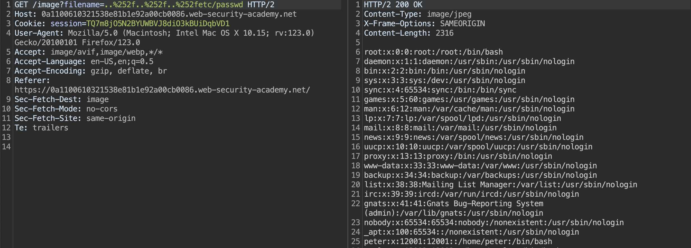
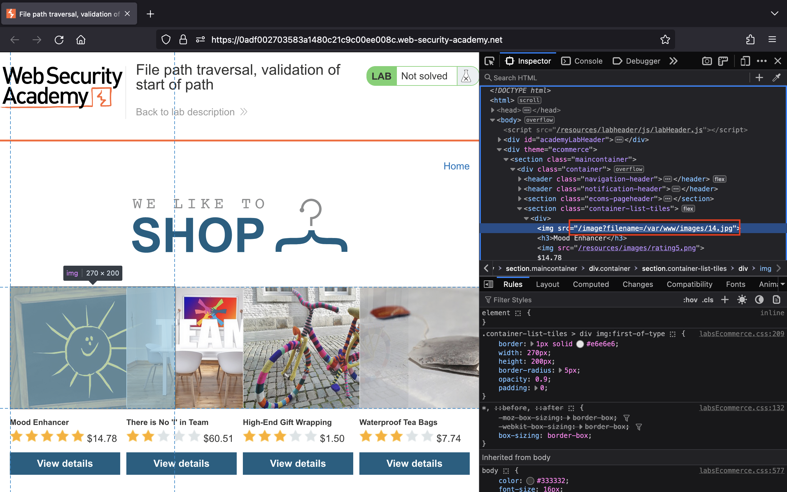
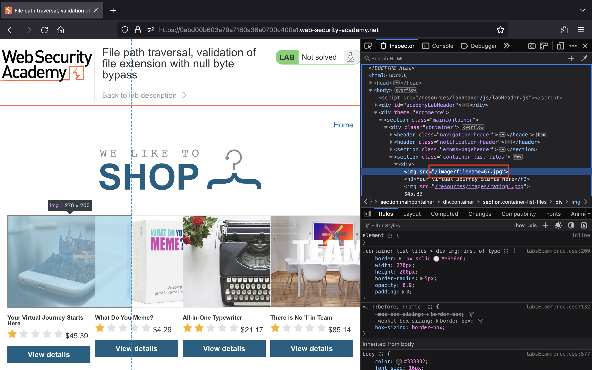
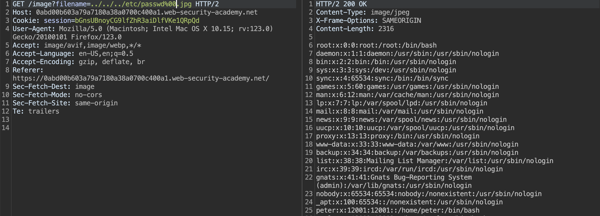

# Path traversal

## Lab 1: [File path traversal, simple case](https://portswigger.net/web-security/file-path-traversal/lab-simple)

> This lab contains a path traversal vulnerability in the display of product images.
>
> To solve the lab, retrieve the contents of the `/etc/passwd` file.

Truy cập vào bài lab, chúng ta nhận thấy ứng dụng tải ảnh thông qua URL `/image` với tham số `filename`:

Chúng ta sẽ đổi giá trị của tham số `filename` thành `../../../etc/passwd` để đọc được nội dung của file `/etc/passwd`:

## Lab 2: [File path traversal, traversal sequences blocked with absolute path bypass](https://portswigger.net/web-security/file-path-traversal/lab-absolute-path-bypass)

> This lab contains a path traversal vulnerability in the display of product images.
>
> The application blocks traversal sequences but treats the supplied filename as being relative to a default working directory.
>
> To solve the lab, retrieve the contents of the `/etc/passwd` file.

Bắt đầu bài lab, chúng ta thấy ứng dụng vẫn tải ảnh thông qua URL `/image` với tham số `filename`:

Lần này, chúng ta sẽ đổi giá trị của tham số `filename` thành `/etc/passwd` để đọc được file `/etc/passwd`:

## Lab 3: [File path traversal, traversal sequences stripped non-recursively](https://portswigger.net/web-security/file-path-traversal/lab-sequences-stripped-non-recursively)

> This lab contains a path traversal vulnerability in the display of product images.
>
> The application strips path traversal sequences from the user-supplied filename before using it.
>
> To solve the lab, retrieve the contents of the `/etc/passwd` file.

Truy cập bài lab, chúng ta thấy ứng dụng tải ảnh thông qua URL `/image` với tham số `filename`:

Bởi vì ứng dụng không loại bỏ triệt để `../` nên chúng ta sẽ truyền payload `....//....//....//etc/passwd` vào tham số `filename` để đọc thành công file `/etc/passwd`:

## Lab 4: [File path traversal, traversal sequences stripped with superfluous URL-decode](https://portswigger.net/web-security/file-path-traversal/lab-superfluous-url-decode)

> This lab contains a path traversal vulnerability in the display of product images.
>
> The application blocks input containing path traversal sequences. It then performs a URL-decode of the input before using it.
>
> To solve the lab, retrieve the contents of the `/etc/passwd` file.

Bắt đầu thử thách, chúng ta vẫn thấy ứng dụng tải ảnh thông qua URL `/image` với tham số `filename`:

Theo như mô tả, ứng dụng đã chặn `../` và decode URL dữ liệu đầu vào của chúng ta trước khi sử dụng. Do đó, chúng ta có thể thực hiện double URL encoding ký tự `/` thành `%252f` để bypass.

Chúng ta sẽ đổi giá trị của tham số `filename` thành payload `..%252f..%252f..%252fetc/passwd` để thành công đọc được file `/etc/passwd`:

## Lab 5: [File path traversal, validation of start of path](https://portswigger.net/web-security/file-path-traversal/lab-validate-start-of-path)

> This lab contains a path traversal vulnerability in the display of product images.
>
> The application transmits the full file path via a request parameter, and validates that the supplied path starts with the expected folder.
>
> To solve the lab, retrieve the contents of the `/etc/passwd` file.

Truy cập vào bài lab, chúng ta tiếp tục thấy ứng dụng tải ảnh thông qua URL `/image` với tham số `filename`:

Lần này ứng dụng yêu cầu tên file ảnh phải bắt đầu với đường dẫn `/var/www/images/` nên chúng ta sẽ đổi giá trị của tham số `filename` thành `/var/www/images/../../../etc/passwd` để đọc được file `/etc/passwd`:

## Lab 6: [File path traversal, validation of file extension with null byte bypass](https://portswigger.net/web-security/file-path-traversal/lab-validate-file-extension-null-byte-bypass)

> This lab contains a path traversal vulnerability in the display of product images.
>
> The application validates that the supplied filename ends with the expected file extension.
>
> To solve the lab, retrieve the contents of the `/etc/passwd` file.

Đến bài lab cuối này, chúng ta thấy ứng dụng vẫn tải ảnh thông qua URL `/image` với tham số `filename`:

Lần này ứng dụng yêu cầu file phải có extension là `.jpg` hoặc `.png` nên chúng ta sẽ tận dụng null byte để thực hiện khai thác.

Chúng ta đổi giá trị của tham số `filename` thành `../../../etc/passwd%00.jpg` để đọc thành công file `/etc/passwd`:

