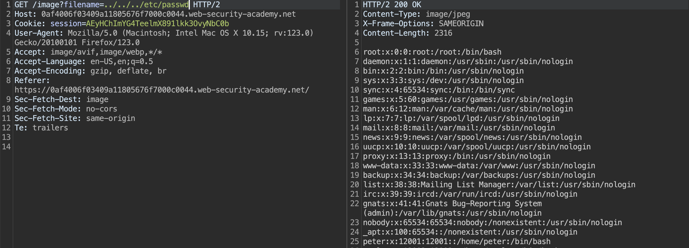
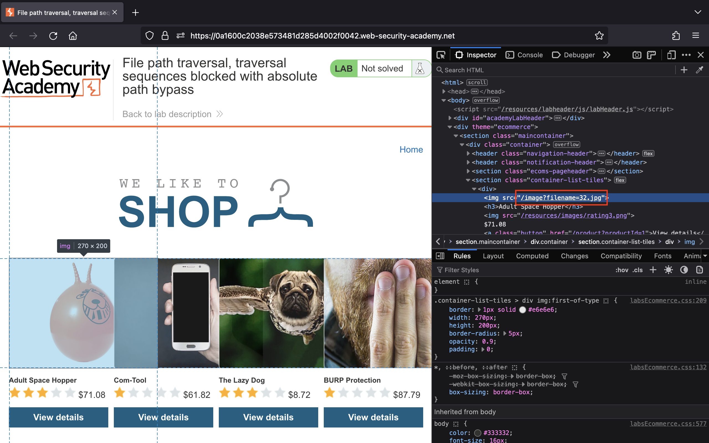
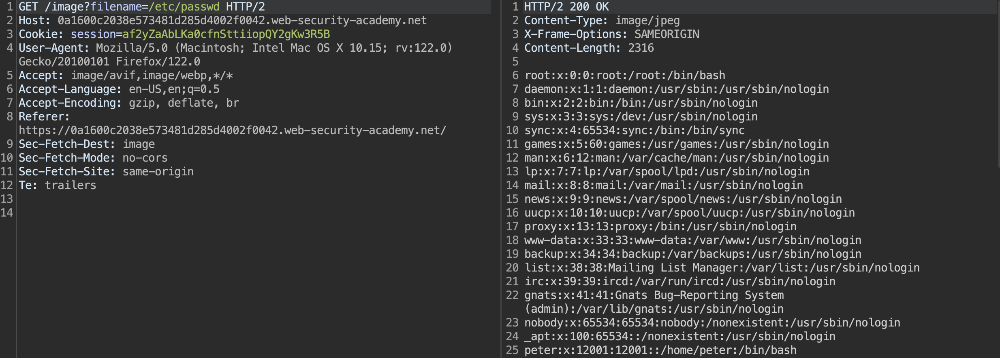
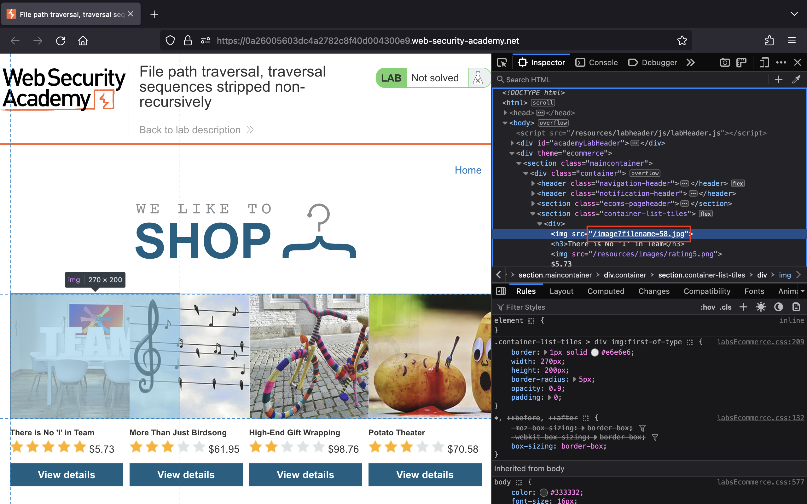

# Path traversal

## Lab 1: [File path traversal, simple case](https://portswigger.net/web-security/file-path-traversal/lab-simple)

> This lab contains a path traversal vulnerability in the display of product images.
>
> To solve the lab, retrieve the contents of the `/etc/passwd` file.

Truy cập vào bài lab, chúng ta nhận thấy ứng dụng tải ảnh thông qua URL `/image` với tham số `filename`:

Chúng ta sẽ đổi giá trị của tham số `filename` thành `../../../etc/passwd` để đọc được nội dung của file `/etc/passwd`:

## Lab 2: [File path traversal, traversal sequences blocked with absolute path bypass](https://portswigger.net/web-security/file-path-traversal/lab-absolute-path-bypass)

> This lab contains a path traversal vulnerability in the display of product images.
>
> The application blocks traversal sequences but treats the supplied filename as being relative to a default working directory.
>
> To solve the lab, retrieve the contents of the `/etc/passwd` file.

Bắt đầu bài lab, chúng ta thấy ứng dụng vẫn tải ảnh thông qua URL `/image` với tham số `filename`:

Lần này, chúng ta sẽ đổi giá trị của tham số `filename` thành `/etc/passwd` để đọc được file `/etc/passwd`:

## Lab 3: [File path traversal, traversal sequences stripped non-recursively](https://portswigger.net/web-security/file-path-traversal/lab-sequences-stripped-non-recursively)

> This lab contains a path traversal vulnerability in the display of product images.
>
> The application strips path traversal sequences from the user-supplied filename before using it.
>
> To solve the lab, retrieve the contents of the `/etc/passwd` file.

Truy cập bài lab, chúng ta thấy ứng dụng tải ảnh thông qua URL `/image` với tham số `filename`:

Bởi vì ứng dụng không loại bỏ triệt để `../` nên chúng ta sẽ truyền payload `....//....//....//etc/passwd` vào tham số `filename` để đọc thành công file `/etc/passwd`:

