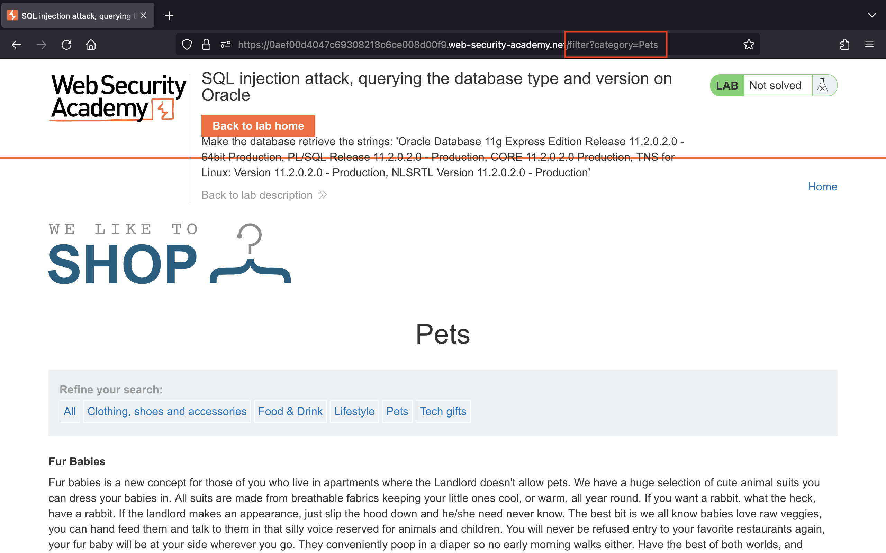

# SQL injection

## Lab 1: [SQL injection vulnerability in WHERE clause allowing retrieval of hidden data](https://portswigger.net/web-security/sql-injection/lab-retrieve-hidden-data)

> This lab contains a SQL injection vulnerability in the product category filter. When the user selects a category, the application carries out a SQL query like the following:
>
> ```sql
> SELECT * FROM products WHERE category = 'Gifts' AND released = 1
> ```
>
> To solve the lab, perform a SQL injection attack that causes the application to display one or more unreleased products.

Truy cập vào lab, chúng ta thấy trang web cho phép xem tất cả các sản phẩm hoặc xem sản phẩm theo từng danh mục:


Bài lab yêu cầu chúng ta phải khiến cho ứng dụng hiển thị một hoặc nhiều sản phẩm chưa release.

Dựa vào câu truy vấn mà bài lab cung cấp, có thể hiểu rằng sản phẩm nào đã release thì released = 1, chúng ta cần xem cả những sản phầm chưa release nên cần bypass phần kiểm tra này.

Do vậy, nếu chúng ta thay đổi giá trị của tham số `category` thành `' or 1=1--` sẽ bỏ được phần `AND released = 1` khỏi câu truy vấn. Lúc này câu truy vấn mà ứng dụng thực thi sẽ trở thành:

```sql
SELECT * FROM products WHERE category = '' or 1=1--' AND released = 1
```

Bởi vì `1=1` luôn đúng nên câu truy vấn sẽ trả về tất cả các sản phẩm bao gồm cả những sản phẩm chưa release:


## Lab 2: [SQL injection vulnerability allowing login bypass](https://portswigger.net/web-security/sql-injection/lab-login-bypass)

> This lab contains a SQL injection vulnerability in the login function.
>
> To solve the lab, perform a SQL injection attack that logs in to the application as the `administrator` user.

Bên dưới là giao diện tại trang đăng nhập:


Bài lab yêu cầu chúng ta đăng nhập với user là `administrator` nhưng chúng ta không biết password.

Chúng ta có thể dự đoán server sẽ thực hiện câu truy vấn:

```sql
SELECT * FROM users WHERE username = '<username>' AND password = '<password>'
```

Vậy chúng ta sẽ nhập username là `administrator'--` và password bất kì để câu truy vấn trở thành:

```sql
SELECT * FROM users WHERE username = 'administrator'--' AND password = '<password>'
```

Từ đó, chúng ta đăng nhập thành công:


## Lab 3: [SQL injection UNION attack, determining the number of columns returned by the query](https://portswigger.net/web-security/sql-injection/union-attacks/lab-determine-number-of-columns)

> This lab contains a SQL injection vulnerability in the product category filter. The results from the query are returned in the application's response, so you can use a UNION attack to retrieve data from other tables. The first step of such an attack is to determine the number of columns that are being returned by the query. You will then use this technique in subsequent labs to construct the full attack.
>
> To solve the lab, determine the number of columns returned by the query by performing a SQL injection UNION attack that returns an additional row containing null values.

Truy cập vào lab, chúng ta xem sản phẩm theo danh mục Pets:


Bài lab yêu cầu chúng ta khiến cho câu truy vấn trả về thêm 1 hàng chứa các giá trị null nên có thể thử với payload `' UNION SELECT NULL--` ở tham số `category`.

Chúng ta nhận được lỗi:


Từ đó, chúng ta hiểu rằng câu truy vấn gốc lấy ra nhiều hơn 1 cột nên mới gây ra lỗi.

Vậy chúng ta tiếp tục thêm lần lượt giá trị null vào payload để kiểm tra và tới payload `' UNION SELECT NULL, NULL, NULL--` sẽ thành công:


## Lab 4: [SQL injection UNION attack, finding a column containing text](https://portswigger.net/web-security/sql-injection/union-attacks/lab-find-column-containing-text)

> This lab contains a SQL injection vulnerability in the product category filter. The results from the query are returned in the application's response, so you can use a UNION attack to retrieve data from other tables. To construct such an attack, you first need to determine the number of columns returned by the query. You can do this using a technique you learned in a previous lab. The next step is to identify a column that is compatible with string data.
>
> The lab will provide a random value that you need to make appear within the query results. To solve the lab, perform a SQL injection UNION attack that returns an additional row containing the value provided. This technique helps you determine which columns are compatible with string data.

Truy cập vào lab, chúng ta sẽ làm tương tự như lab 3 để tìm số cột được trả về từ câu truy vấn:


Xác định được có 3 cột dữ liệu, tiếp đến cần tìm cột có loại dữ liệu phù hợp để chứa được chuỗi `'hJ2Xhz'` nên chúng ta thay lần lượt chuỗi đó vào từng `NULL` trong payload.

Thử thay `'hJ2Xhz'` vào `NULL` đầu tiên nhận được lỗi:


Vậy là cột 1 không trùng khớp loại dữ liệu. Giờ chúng ta thay chuỗi `'hJ2Xhz'` vào `NULL` thứ hai sẽ thành công:


## Lab 5: [SQL injection attack, querying the database type and version on Oracle](https://portswigger.net/web-security/sql-injection/examining-the-database/lab-querying-database-version-oracle)

> This lab contains a SQL injection vulnerability in the product category filter. You can use a UNION attack to retrieve the results from an injected query.
>
> To solve the lab, display the database version string.
>
> **Hint**
>
> On Oracle databases, every `SELECT` statement must specify a table to select `FROM`. If your `UNION SELECT` attack does not query from a table, you will still need to include the `FROM` keyword followed by a valid table name.
>
> There is a built-in table on Oracle called `dual` which you can use for this purpose. For example: `UNION SELECT 'abc' FROM dual`

Truy cập vào lab, chúng ta có thể đọc các thông tin theo danh mục, ví dụ như Pets:



Bài lab yêu cầu chúng ta phải khiến cho ứng dụng trả về phiên bản của database.

Trước tiên, cần xem xét câu truy vấn ban đầu trả về bao nhiêu cột. Dựa vào hint, mỗi câu lệnh `SELECT` ở Oracle database phải chỉ định một bảng hợp lệ nên chúng ta sẽ tận dụng bảng `dual` và sử dụng payload `' UNION SELECT NULL FROM dual--` để kiểm tra.


Đã có lỗi xảy ra, như vậy là câu truy vấn gốc trả về nhiều hơn 1 cột. Chúng ta tiếp tục thêm giá trị null vào để kiểm tra và xác định được số cột là 2.


Tiếp theo, cần xem cột nào có thể chứa chuỗi, chúng ta dùng payload `' UNION SELECT 'hehe', NULL FROM dual--` thấy được cột 1 có thể nhận chuỗi.


Giờ có thể lấy database version bằng cách sử dụng payload `' UNION SELECT banner, NULL FROM v$version--`.


## Lab 6: [SQL injection attack, querying the database type and version on MySQL and Microsoft](https://portswigger.net/web-security/sql-injection/examining-the-database/lab-querying-database-version-mysql-microsoft)

> This lab contains a SQL injection vulnerability in the product category filter. You can use a UNION attack to retrieve the results from an injected query.
>
> To solve the lab, display the database version string.

Bài lab này cũng yêu cầu chúng ta lấy được phiên bản của database.

Truy cập lab, chúng ta vào xem theo danh mục Gifts:


Trước tiên, chúng ta xác định được câu truy vấn gốc trả về 2 cột bằng cách sử dụng payload `' UNION SELECT NULL, NULL--+`:


Tiếp theo, với payload `' UNION SELECT 'hehe', NULL--+` xác định được cột 1 có thể chứa chuỗi:


Và cuối cùng, chúng ta sẽ sử dụng payload `' UNION SELECT @@version, NULL--+` để xem được phiên bản của database:


## Lab 7: [SQL injection attack, listing the database contents on non-Oracle databases](https://portswigger.net/web-security/sql-injection/examining-the-database/lab-listing-database-contents-non-oracle)

> This lab contains a SQL injection vulnerability in the product category filter. The results from the query are returned in the application's response so you can use a UNION attack to retrieve data from other tables.
>
> The application has a login function, and the database contains a table that holds usernames and passwords. You need to determine the name of this table and the columns it contains, then retrieve the contents of the table to obtain the username and password of all users.
>
> To solve the lab, log in as the `administrator` user.

Truy cập lab, chúng ta vào xem theo danh mục Pets:


Tương tự như mấy lab trước, biết được câu truy vấn trả về 2 cột và cột 1 có thể chứa chuỗi nên chúng ta sử dụng payload `' UNION SELECT table_name, NULL FROM information_schema.tables--` để xem được danh sách các bảng của database:


Thấy có bảng `users_jipqgs`, chúng ta liệt kê các cột của bảng này với payload `' UNION SELECT column_name, NULL FROM information_schema.columns WHERE table_name='users_jipqgs'--`.

Chúng ta sẽ thấy 2 cột là `password_uaaenk` và `username_unitwp`:


Tiếp đến, đọc nội dung của 2 cột đó với payload `' UNION SELECT password_uaaenk, username_unitwp FROM users_jipqgs--` để lấy được thông tin của `administrator`:


Và cuối cùng đăng nhập thành công với `administrator:fvsh52kiu4l0i059vzsp`.

## Lab 8: [Lab: SQL injection attack, listing the database contents on Oracle](https://portswigger.net/web-security/sql-injection/examining-the-database/lab-listing-database-contents-oracle)

> This lab contains a SQL injection vulnerability in the product category filter. The results from the query are returned in the application's response so you can use a UNION attack to retrieve data from other tables.
>
> The application has a login function, and the database contains a table that holds usernames and passwords. You need to determine the name of this table and the columns it contains, then retrieve the contents of the table to obtain the username and password of all users.
>
> To solve the lab, log in as the `administrator` user.
>
> **Hint**
>
> On Oracle databases, every `SELECT` statement must specify a table to select `FROM`. If your `UNION SELECT` attack does not query from a table, you will still need to include the `FROM` keyword followed by a valid table name.
>
> There is a built-in table on Oracle called `dual` which you can use for this purpose. For example: `UNION SELECT 'abc' FROM dual`

Tương tự như lab trước nhưng do ứng dụng sử dụng Oracle database nên payload có chút khác biệt.

Chúng ta biết được số cột mà câu truy vấn trả về là 2 nên sử dụng payload `' UNION SELECT table_name, NULL FROM all_tables--` để liệt kê các bảng của database:


Tiếp theo, để liệt kê các cột của bảng `USERS_XAFIWJ`, chúng ta dùng payload `' UNION SELECT column_name, NULL FROM all_tab_columns WHERE table_name='USERS_XAFIWJ'--`.

Có 2 cột là `PASSWORD_OSXRXI` và `USERNAME_ORDSTE`:


Chúng ta đọc nội dung của 2 cột đó với payload `' UNION SELECT PASSWORD_OSXRXI, USERNAME_ORDSTE FROM USERS_XAFIWJ--` thấy được thông tin của `administrator`:


Vậy chúng ta đăng nhập thành công với `administrator:cf56hm9edw7pjhds65t3`.
